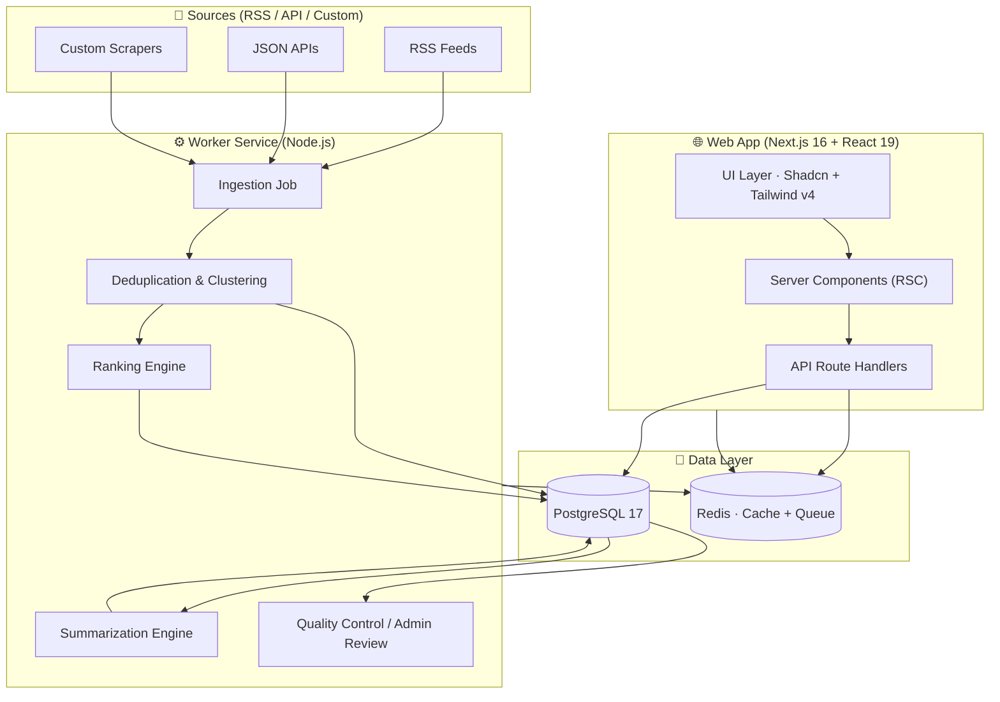
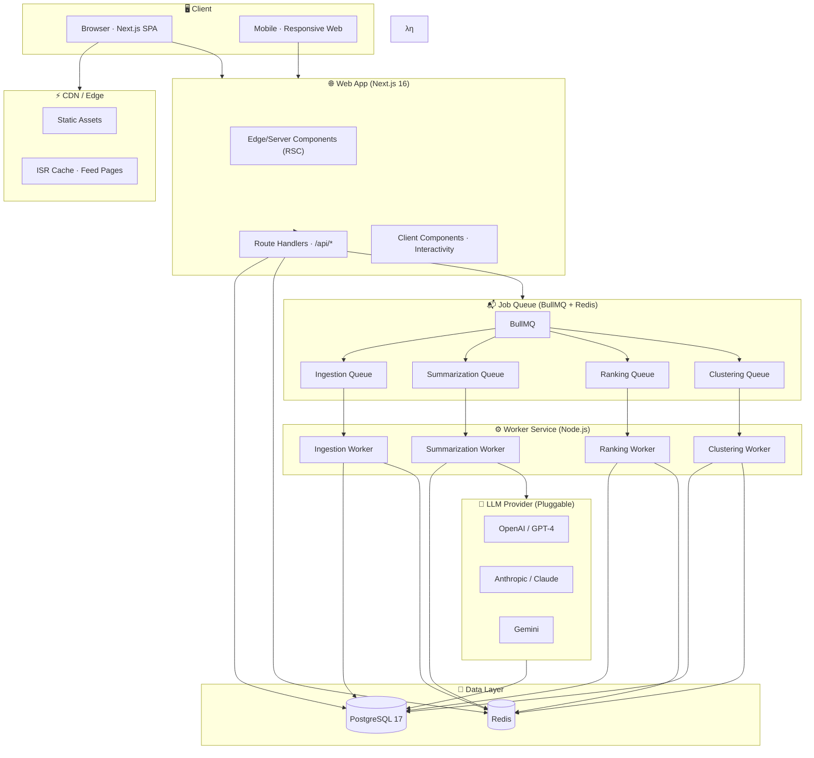
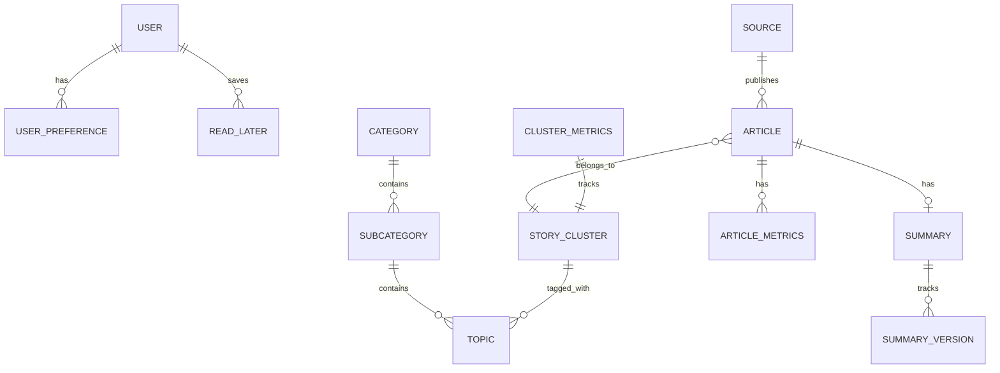
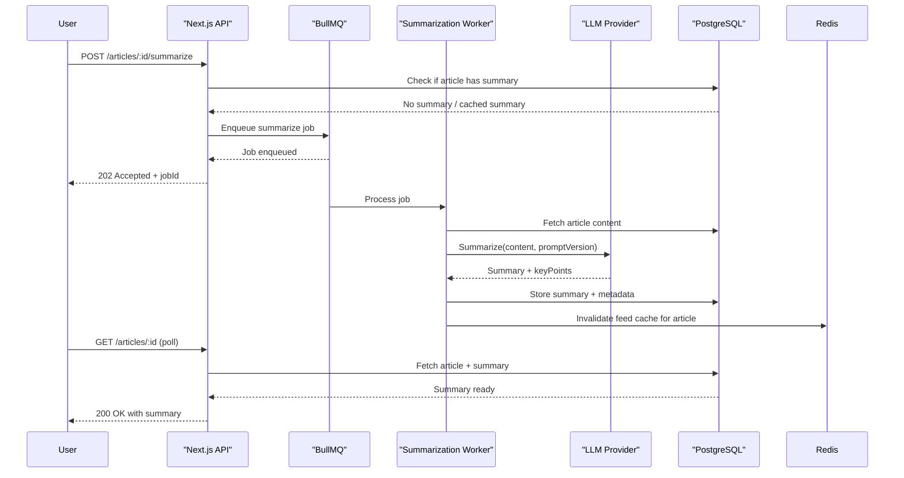
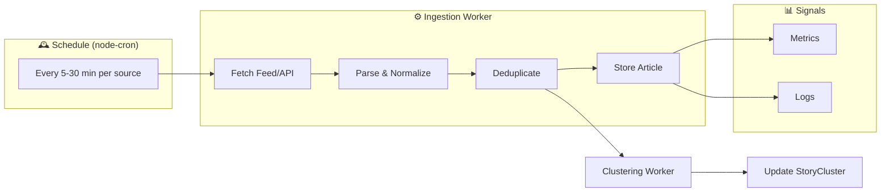

# OneStopNews · Project Architecture Document

> **Version:** 2.0 Re-imagined · **Status:** Architecture Baseline for Production Engineering  
> **Author:** Claw Code — Frontend Architect & Technical Partner  
> **Date:** 2026-06-08  
> **Classification:** Internal — Engineering, Product, Design, Operations

---

## Table of Contents

| # | Section | Purpose |
|---|---------|---------|
| 1 | [Executive Summary](#1-executive-summary) | "What is OneStopNews and why does it exist?" |
| 2 | [Product Vision & Positioning](#2-product-vision--positioning) | Long-term strategic direction |
| 3 | [Conceptual Architecture](#3-conceptual-architecture) | Domain philosophy — topic-first, story-first, AI-optional |
| 4 | [Target Users & Personas](#4-target-users--personas) | Who we build for |
| 5 | [Information Architecture](#5-information-architecture) | How content is organized and navigated |
| 6 | [Story Cluster Architecture](#6-story-cluster-architecture) | **The core differentiator — first-class domain object** |
| 7 | [System Architecture](#7-system-architecture) | Modular monolith + Worker + Queue + Database |
| 8 | [Data Model & Storage Strategy](#8-data-model--storage-strategy) | PostgreSQL schema, indexing, migration strategy |
| 9 | [API Design](#9-api-design) | Contract-first REST with typed schemas |
| 10 | [Frontend Architecture](#10-frontend-architecture) | Next.js 16 App Router, feature-based code organization |
| 11 | [Design System](#11-design-system) | Editorial-industrial visual language |
| 12 | [AI Summary System](#12-ai-summary-system) | Summarization pipeline, governance, caching |
| 13 | [Ingestion & Deduplication Pipeline](#13-ingestion--deduplication-pipeline) | RSS/API → Normalize → Deduplicate → Persist |
| 14 | [Ranking & Impact Scoring](#14-ranking--impact-scoring) | How importance is calculated |
| 15 | [Search & Discovery Architecture](#15-search--discovery-architecture) | V1 Postgres FTS → V2 Meilisearch → V3 OpenSearch |
| 16 | [Caching Strategy](#16-caching-strategy) | RSC caching, Redis, CDN, feed pre-computation |
| 17 | [Security & Compliance](#17-security--compliance) | OWASP 2025, AI safety, data governance |
| 18 | [Observability & Operations](#18-observability--operations) | Metrics, logging, tracing, alerting, runbooks |
| 19 | [Performance & Scalability](#19-performance--scalability) | Latency targets, horizontal scaling, read replicas |
| 20 | [Rollout Plan & Roadmap](#20-rollout-plan--roadmap) | Phased delivery with success criteria |
| 21 | [Risk Register](#21-risk-register) | Threats, mitigation, open questions |

---

## 1. Executive Summary

OneStopNews is a **topic-first, story-centric news intelligence platform** that helps people understand what is happening in the world by organizing information around *events and topics* rather than publishers and feeds.

> **Core Principle:** *"Everything important, sorted by topic."*

The architecture is designed as a **modular monolith** — deliberately rejecting premature microserviceization — with a clear separation between the **consumer-facing web application** and the **ingestion/worker tier**. This balances fast delivery and developer velocity with enterprise-grade reliability, observability, and scaling headroom.

### What Makes This Architecture Different

| Dimension | Conventional News Aggregator | OneStopNews |
|-----------|------------------------------|-------------|
| **Organization** | By publisher/source | By **topic + story cluster** |
| **Unit of Consumption** | Individual article | **Event cluster** (multi-source story) |
| **AI Role** | AI-generated content / replacement | **AI-assisted compression** (optional, on-demand) |
| **Design** | Generic SaaS dashboards, purple gradients | **Editorial-industrial terminal** — calm, dense, premium |
| **Information Density** | Card grids with generous whitespace | **Story maps** with progressive density |
| **Trust Model** | Opaque algorithms | **Source-transparent, auditable, publisher-first** |

### Architecture at a Glance



---

## 2. Product Vision & Positioning

### 2.1 Vision Statement

> *"Become the fastest and most trusted way to understand important news by organizing information around stories instead of publishers."*

### 2.2 Strategic Positioning

OneStopNews occupies a unique position in the market — between **Google News** (algorithmic, noisy) and **Feedly** (power-user, source-centric), with the **editorial density of a newsroom terminal** and the **calm UX of a premium reading product**.

| Competitor | Strength | OneStopNews Differentiation |
|------------|----------|----------------------------|
| Google News | Scale, speed | Topic-first IA, editorial density, cluster intelligence |
| Ground News | Bias transparency | Less political framing, calmer UX |
| Feedly | Power-user monitoring | Consumer-first, no RSS literacy required |
| SmartNews | Mobile scan efficiency | Information density, desktop-class experience |
| Inoreader | Enterprise RSS | Not an RSS reader — topic-first by default |
| Artifact (RIP) | AI-powered discovery | Story-first, not article-first |

### 2.3 Core Product Principles

| Principle | Meaning |
|-----------|---------|
| **Topic First** | Topics are the primary navigation axis. Sources are secondary metadata. |
| **Story First** | Events matter more than individual articles. A story cluster is the atomic unit. |
| **AI Optional** | AI summarizes, compresses, and assists — it does not replace original journalism. |
| **Source Respectful** | Every article links to the original publisher. Full articles are never republished. |
| **Scan Optimized** | Users should understand major developments without reading every story. |
| **Trust Through Transparency** | Source visible, AI labeled, algorithms auditable. |

---

## 3. Conceptual Architecture

### 3.1 The OneStopNews Mental Model

```
┌─────────────────────────────────────────────────────────┐
│                    OneStopNews                            │
│────────────── Over: News Layer ─────────────────────────│
│  ┌─────────┐  ┌─────────┐  ┌─────────┐  ┌───────────┐   │
│  │   Top   │  │  Tech   │  │ Finance │  │  Politics │   │
│  │ Stories │  │  News   │  │  News   │  │   News    │   │
│  └────┬────┘  └────┬────┘  └────┬────┘  └─────┬─────┘   │
│       │            │            │              │         │
│  ┌────▼────────────▼────────────▼──────────────▼─────┐   │
│  │              Story Clusters                       │   │
│  │  "Apple Announces AI Strategy" (32 sources)       │   │
│  │  "Singapore Housing Policy Shift" (14 sources)    │   │
│  │  "Nvidia Earnings Beat" (21 sources)              │   │
│  └───────────────────────────────────────────────────┘   │
│  ┌───────────────────────────────────────────────────┐   │
│  │              Article Detail                        │   │
│  │  AI Summary  |  Original Source  |  Key Takeaways   │   │
│  └───────────────────────────────────────────────────┘   │
└─────────────────────────────────────────────────────────┘
```

### 3.2 Domain-Driven Design Overview

The architecture maps to four bounded contexts:

| Bounded Context | Responsibility | Key Entities |
|-----------------|----------------|--------------|
| **Ingestion** | Fetch, normalize, deduplicate | Source, IngestionJob, Article |
| **Clustering** | Group related articles into stories | StoryCluster, Topic, Article |
| **Summarization** | AI compression with governance | Summary, SummaryVersion, Prompt |
| **Presentation** | Feed rendering, search, admin | User, UserPreference, FeedSlice, Admin |

---

## 4. Target Users & Personas

### 4.1 Persona 1: Daily Scanner (Highest Priority)

> *"I check news 3-5 times a day. I want to know what's important without reading everything."*

- **Behavior:** Opens app multiple times, skims headlines, reads 1-2 full articles per session.
- **Needs:** Fast scanning, topic filtering, minimal cognitive load.
- **Device:** 70% mobile, 30% desktop.
- **Goals:** Stay informed with minimal time investment.

### 4.2 Persona 2: Curious Professional (High Priority)

> *"I follow tech and finance closely. I need to understand trends, not just headlines."*

- **Behavior:** Reads summaries frequently, uses search, follows specific subcategories.
- **Needs:** AI compression, reliable topic groupings, source diversity.
- **Device:** 50/50 desktop/mobile.
- **Goals:** Efficient industry awareness for professional context.

### 4.3 Persona 3: Enthusiast (Medium Priority)

> *"I read deeply about specific topics. I want niche coverage and historical context."*

- **Behavior:** Long reading sessions, uses search heavily, explores deep archives.
- **Needs:** Search, topic depth, read-later, saved searches.
- **Device:** Primarily desktop.
- **Goals:** Deep expertise and historical trend analysis.

### 4.4 Persona 4: Editor / Admin

> *"I manage sources, monitor system health, and ensure content quality."*

- **Behavior:** Monitors dashboards, adjusts source configurations, reviews AI outputs.
- **Needs:** Source CRUD, ingestion health dashboards, summary QA, cost monitoring.
- **Device:** Desktop primarily.
- **Goals:** Operational excellence and content integrity.

---

## 5. Information Architecture

### 5.1 Taxonomy Strategy

The content taxonomy is **curated but dynamic** — editors seed categories, but the system adapts based on clustering and entity extraction.

#### Top-Level Categories

| Category | Slug | Subcategories (examples) | Color Token |
|----------|------|---------------------------|-------------|
| Top Stories | `top` | All top stories, Breaking, Editor's picks | `#151719` |
| Local News | `local` | Singapore transport, housing, local business | `#405247` |
| Tech News | `tech` | Apple & devices, AI & ML, startups, cybersecurity | `#243b55` |
| Global News | `global` | China, US, Asia-Pacific, Europe, Middle East | `#334155` |
| Finance News | `finance` | Markets, earnings, personal finance, crypto | `#2f3a2f` |
| Politics News | `politics` | SG politics, US politics, China politics, geopolitics | `#3f3446` |
| Culture | `culture` | Entertainment, K-culture, internet culture, sports | `#6d637e` |

> **Design Decision:** "Gossip" was renamed to "Culture" for broader appeal, advertiser friendliness, and brand positioning.

#### Dynamic Topics (Entity Model — Roadmap)

Beyond static categories, the system supports **entity extraction** for dynamic topic surfacing:
- Named entities (Apple, Nvidia, Trump, Singapore Airlines)
- Domain-specific topics (AI regulation, EV adoption, interest rates)
- Trending clusters (auto-detected from velocity)

### 5.2 Navigation Architecture

```
┌────────────────────────────────────────────────────────┐
│ [Brand]  [Topic Nav Ribbon]                    [Search│
├────────────────────────────────────────────────────────┤
│ ┌─────────────┐  ┌────────────────────────┐  ┌───────┐│
│ │ Topic Menu  │  │ Feed (Lead + Grid)     │  │Detail ││
│ │             │  │                        │  │Panel  ││
│ │ Top         │  │ ┌──────────────────┐  │  │       ││
│ │ Local ▶     │  │ │ Lead Story       │  │  │AI     ││
│ │ Tech ▶      │  │ │ [Summary Toggle] │  │  │Summary││
│ │ Global ▶    │  │ └──────────────────┘  │  │       ││
│ │ Finance ▶   │  │ ┌────┐ ┌────┐ ┌────┐ │  │       ││
│ │ Politics ▶   │  │ │Art │ │Art │ │Art │ │  │       ││
│ │ Culture ▶    │  │ │icle│ │icle│ │icle│ │  │       ││
│ └─────────────┘  │ └────┘ └────┘ └────┘ │  │       ││
│                  │                       │  │       ││
│                  └───────────────────────┘  └───────┘│
└────────────────────────────────────────────────────────┘
              Desktop (≥1220px) Three-Zone Layout

┌─────────────────────────┐
│ [Brand]  [Topic Nav]    │
├─────────────────────────┤
│ Controls + Filters      │
├─────────────────────────┤
│ Feed (Single Column)    │
│                         │
│ ┌─────────────────────┐ │
│ │ Lead Story          │ │
│ └─────────────────────┘ │
│ ┌─────┐ ┌─────┐       │
│ │Card │ │Card │ ...    │
│ └─────┘ └─────┘       │
└─────────────────────────┘
  Mobile + Tablet Stacked Layout
```

### 5.3 URL & Routing Schema

| URL | Description |
|-----|-------------|
| `/` | Default feed — Top Stories / All |
| `/topics/[category]` | Category default subcategory |
| `/topics/[category]/[subcategory]` | Filtered feed |
| `/article/[id]` | Standalone article detail (deep link) |
| `/search?q=...` | Search results |
| `/admin` | Admin dashboard (protected) |
| `/admin/sources` | Source management (protected) |
| `/admin/ingestion` | Ingestion monitoring (protected) |
| `/admin/summaries` | Summary QA (protected) |

---

## 6. Story Cluster Architecture

> **⚠️ ARCHITECTURAL DECISION: Story Clusters are a first-class domain object. This is the single highest-impact design choice in the OneStopNews platform.**

### 6.1 Why Story Clusters Matter

Users think: *"What's happening with Apple?"*  
Not: *"What did Reuters publish?"*

Story clusters transform the platform from an **article reader** into a **news intelligence terminal**.

### 6.2 Story Cluster Schema

```typescript
interface StoryCluster {
  id: ClusterId;
  title: string;             // Representative headline
  slug: string;               // URL-safe identifier
  summary: string;            // Brief cluster overview
  categoryId: CategoryId;
  subcategoryId?: SubcategoryId;
  
  // Scoring
  importanceScore: number;    // Composite: recency × authority × coverage
  trendDirection: 'rising' | 'stable' | 'falling';
  
  // Coverage
  articleCount: number;
  sourceCount: number;
  sources: string[];         // Unique publisher names
  
  // Timestamps
  firstArticleAt: Date;
  lastArticleAt: Date;
  updatedAt: Date;
  
  // AI
  clusterSummary?: ClusterSummary;
  
  // Status
  status: 'active' | 'merged' | 'archived';
  mergedIntoId?: ClusterId;
}
```

### 6.3 Clustering Algorithm (V1)

```
┌─────────────────────────────────────────────────────────┐
│                    Clustering Pipeline                   │
├─────────────────────────────────────────────────────────┤
│ 1. INGEST → Article landing                              │
│    ↓                                                    │
│ 2. DEDUPLICATE → Canonical URL + Content Hash             │
│    ↓                                                    │
│ 3. EXTRACT ENTITIES → Named Entity Recognition (NER)    │
│    ↓                                                    │
│ 4. SIMILARITY SCORING → TF-IDF + Embedding similarity    │
│    ↓                                                    │
│ 5. CLUSTER ASSIGNMENT → DBSCAN / Hierarchical clustering  │
│    ↓ (Optionally split)                                 │
│ 6. CLUSTER MERGE → Deduplicate overlapping clusters    │
│    ↓                                                    │
│ 7. IMPORTANCE SCORING → Composite ranking               │
│    ↓                                                    │
│ 8. PERSIST → Store cluster + article links                │
└─────────────────────────────────────────────────────────┘
```

> **Note:** V1 uses a **simplified similarity approach** (title similarity + entity overlap + time proximity). V2 introduces embeddings-based clustering.

---

## 7. System Architecture

### 7.1 High-Level Component Diagram



### 7.2 Internal Layering (Clean Architecture)

Within each deployable (Web App and Worker), code follows **layered architecture** with feature-based organization:

```
┌─────────────────────────────────────────────────────────┐
│  UI Layer (apps/web only)                               │
│  ├─ Shadcn components + design system                     │
│  ├─ Feature-specific layouts                            │
│  ├─ Server/Client Component boundaries                   │
│  └─ 80%+ Server Components (RSC)                         │
├─────────────────────────────────────────────────────────┤
│  Application Layer                                      │
│  ├─ Route Handlers (Next.js API routes)                 │
│  ├─ Server Actions                                      │
│  ├─ RSC Data Loaders                                    │
│  ├─ Job Enqueuing (ingestion, summarization triggers)   │
│  └─ Domain Service Orchestration                        │
├─────────────────────────────────────────────────────────┤
│  Domain Layer (packages/domain)                         │
│  ├─ Core business logic ZERO framework dependencies     │
│  ├─ Articles, Sources, Summaries, Ranking, Clusters     │
│  ├─ Pure TypeScript functions/classes                   │
│  └─ Unit testable, reusable across web + worker         │
├─────────────────────────────────────────────────────────┤
│  Infrastructure Layer                                   │
│  ├─ packages/db: ORM, queries, migrations                │
│  ├─ packages/config: env, logging, queue clients       │
│  └─ External: PostgreSQL, Redis, LLM API               │
└─────────────────────────────────────────────────────────┘
```

---

## 8. Data Model & Storage Strategy

### 8.1 Core Entity Diagram (Simplified)



### 8.2 Primary Entities

#### Source
```typescript
interface Source {
  id: SourceId;
  name: string;
  type: 'rss' | 'atom' | 'json_api' | 'custom';
  url: string;
  feedUrl?: string;
  apiConfig?: Record<string, unknown>;
  pollIntervalMinutes: number;
  priority: number;           // 1-10, affects scheduling
  status: 'online' | 'degraded' | 'offline';
  lastSuccessAt?: Date;
  lastErrorAt?: Date;
  lastError?: string;
  defaultCategoryId: CategoryId;
  createdAt: Date;
  updatedAt: Date;
}
```

#### Article
```typescript
interface Article {
  id: ArticleId;
  sourceId: SourceId;
  canonicalUrl: string;
  normalizedUrl: string;
  title: string;
  normalizedTitle: string;
  excerpt?: string;
  content?: string;            // Fair-use excerpt or full text
  contentAvailability: 'title' | 'excerpt' | 'partial' | 'full';
  
  categoryId: CategoryId;
  subcategoryId?: SubcategoryId;
  topics?: TopicId[];
  
  // Clustering
  storyClusterId?: ClusterId;
  dedupeGroupId?: string;
  
  // Content
  language: string;
  publishedAt: Date;
  fetchedAt: Date;
  
  // Scoring
  importanceScore: number;
  hasSummary: boolean;
  summaryStatus: 'none' | 'pending' | 'ok' | 'needs_review' | 'failed';
  
  // Metadata
  imageUrl?: string;
  author?: string;
  tags?: string[];
  
  createdAt: Date;
  updatedAt: Date;
}
```

#### StoryCluster
```typescript
interface StoryCluster {
  id: ClusterId;
  title: string;
  slug: string;
  summary?: string;
  categoryId: CategoryId;
  subcategoryId?: SubcategoryId;
  topics?: TopicId[];
  
  // Scoring
  importanceScore: number;
  trendDirection: 'rising' | 'stable' | 'falling';
  
  // Coverage
  articleCount: number;
  sourceCount: number;
  sourceDiversity: number;      // 0-1 score
  
  // Timestamps
  firstArticleAt: Date;
  lastArticleAt: Date;
  
  // AI
  clusterSummary?: ClusterSummary;
  
  // Status
  status: 'active' | 'merged' | 'archived';
  mergedIntoId?: ClusterId;
  
  createdAt: Date;
  updatedAt: Date;
}
```

#### Summary
```typescript
interface Summary {
  id: SummaryId;
  articleId: ArticleId;
  
  // Content
  summaryText: string;
  keyPoints: string[];
  whyItMatters?: string;
  
  // AI Provenance
  basedOn: string;              // What content was summarized
  modelName: string;
  modelVersion: string;
  promptVersion: string;        // Prompt template version for reproducibility
  tokenUsage: { prompt: number; completion: number };
  
  // Governance
  status: 'ok' | 'needs_review' | 'disabled' | 'failed';
  generatedAt: Date;
  reviewedAt?: Date;
  reviewedBy?: UserId;
  
  // Audit
  generationDurationMs: number;
  retryCount: number;
}
```

#### FeedSlice (Pre-computed Feed Cache)
```typescript
interface FeedSlice {
  id: string;
  key: string;                   // "category:tech:sub:ai:sort:latest"
  articleIds: string[];          // Ordered list of article IDs
  clusterIds: string[];          // Parallel cluster IDs
  totalCount: number;
  computedAt: Date;
  expiresAt: Date;
}
```

### 8.3 Indexing Strategy

| Table | Index | Purpose |
|-------|-------|---------|
| `Article` | `(categoryId, publishedAt DESC)` | Primary feed queries |
| `Article` | `(subcategoryId, publishedAt DESC)` | Subcategory feed queries |
| `Article` | `(storyClusterId)` | Cluster membership lookups |
| `Article` | `GIN(fullTextSearch)` | PostgreSQL FTS on title/excerpt/content |
| `Article` | `(canonicalUrl)` (UNIQUE) | Deduplication |
| `Article` | `(fetchedAt)` | Ingestion monitoring |
| `StoryCluster` | `(categoryId, importanceScore DESC)` | Top cluster queries |
| `StoryCluster` | `(lastArticleAt DESC)` | Active cluster queries |
| `Summary` | `(articleId)` | Summary lookup |
| `IngestionJob` | `(sourceId, startedAt DESC)` | Source health monitoring |
| `Source` | `(status, lastSuccessAt)` | Stale source detection |

### 8.4 PostgreSQL Configuration

- **Production:** PostgreSQL 17 with read replicas via AWS RDS / Neon / Supabase
- **Development:** PostgreSQL 17 Docker container (same version as production)
- **Migration Tool:** Prisma ORM with schema-first workflow
- **Connection Pooling:** PgBouncer in production
- **Backup Strategy:** Automated daily snapshots + point-in-time recovery

---

## 9. API Design

> **Principle:** APIs follow a **contract-first** approach. Every endpoint has typed input/output Zod schemas. Errors follow a single consistent format.

### 9.1 Error Response Format

```json
{
  "error": {
    "code": "VALIDATION_ERROR",
    "message": "Invalid sort parameter. Expected: 'latest', 'impact', 'summaryReady'",
    "details": { "field": "sort", "provided": "oldest", "allowed": ["latest", "impact", "summaryReady"] }
  }
}
```

### 9.2 Public API Endpoints

#### Categories
```
GET /api/v1/categories
→ 200 OK
  { categories: [ { id, label, slug, description, subcategories[], articleCount, storyCount } ] }
```

#### Feed
```
GET /api/v1/articles
  ?category={slug}&subcategory={slug}&sort={latest|impact|summaryReady}
  &q={searchQuery}&page={number}&pageSize={number}
→ 200 OK
  {
    articles: ArticleDTO[],
    clusters: ClusterDTO[],          // Story cluster data for rendering
    counts: { total, category, subcategory },
    indexed: number,                 // Total articles in system
    summarized: number,
    page: number,
    pageSize: number,
    totalPages: number
  }

GET /api/v1/articles/:id
→ 200 OK { article: ArticleDTO, summary?: SummaryDTO, cluster?: ClusterDTO }
```

#### Search
```
GET /api/v1/search?q={query}&category={slug}&subcategory={slug}
  &sort={relevance|latest|impact}&page={number}&pageSize={number}
→ 200 OK { articles: ArticleDTO[], total: number, page, pageSize, totalPages }
```

#### Summarization
```
POST /api/v1/articles/:id/summarize
→ 202 Accepted { jobId: string, status: 'pending', estimatedSeconds: number }

GET /api/v1/summaries/:id/status
→ 200 OK { status: 'pending' | 'processing' | 'completed' | 'failed', summary?: SummaryDTO }
```

#### Source Health
```
GET /api/v1/source-health
→ 200 OK { sources: SourceHealthDTO[] }
```

### 9.3 Admin API Endpoints (protected, RBAC)

```
POST   /api/v1/admin/sources              → Create new source
PATCH  /api/v1/admin/sources/:id           → Update source configuration
POST   /api/v1/admin/sources/:id/enable    → Enable source
POST   /api/v1/admin/sources/:id/disable   → Disable source
POST   /api/v1/admin/ingest                → Trigger ingestion (all or per-source)
GET    /api/v1/admin/ingestion/jobs        → List ingestion job history
GET    /api/v1/admin/summaries             → Summary QA dashboard data
PATCH  /api/v1/admin/summaries/:id/review  → Flag summary for review
POST   /api/v1/admin/summaries/:id/regen   → Trigger summary regeneration
```

---

## 10. Frontend Architecture

### 10.1 Technology Stack

| Layer | Technology |
|-------|-----------|
| Framework | Next.js 16+ (App Router) |
| Language | TypeScript (strict mode, no `any`) |
| UI Engine | React 19+ |
| Styling | Tailwind CSS v4 + CSS variables |
| Components | Shadcn UI (Radix primitives) |
| State | Server Components + URL state (TanStack Table for tables) |
| Fetching | Server Actions + Route Handlers (no React Query needed for V1) |
| Fonts | Newsreader (headlines) + Satoshi (UI) |
| Icons | Lucide React |

### 10.2 Repository Structure

```text
apps/
  web/
    src/
      app/                      # Next.js App Router
        (marketing)/
          page.tsx              # Landing page
          layout.tsx
        (app)/
          topics/
            [category]/
              [subcategory]/page.tsx
            [category]/page.tsx
          article/[id]/page.tsx
          search/page.tsx
          layout.tsx            # App shell, topic nav, detail panel
        api/                    # Route handlers
          articles/route.ts
          categories/route.ts
          search/route.ts
          summarization/route.ts
          source-health/route.ts
          admin/                # Admin route handlers
      features/
        topics/                 # Topic navigation, category/subcategory logic
        feed/                   # Lead card, article grid, feed layout
        article-detail/         # Detail panel, summary toggle, source link
        search/                 # Search interface, filters, results
        admin/                  # Admin dashboard, source management
      shared/
        components/             # Shared low-level components
        hooks/                  # Reusable React hooks
        lib/                    # Utilities, helpers
        types/                  # Shared TypeScript types
    package.json
    tsconfig.json
    tailwind.config.ts

  worker/
    src/
      jobs/
        ingestion/
        summarization/
        ranking/
        clustering/
      services/
    package.json

packages/
  domain/                     # Pure business logic (zero framework deps)
  db/                         # Prisma client, migrations, seed data
  ui/                         # Shadcn components, design system tokens
  config/                     # Shared env parsing, logging, constants
  utils/                      # Date, string, format utilities
  types/                      # Shared TypeScript interfaces
```

### 10.3 Server/Client Component Strategy

```
┌─────────────────────────────────────────────────────────┐
│                   Next.js Page                          │
│  ┌───────────────────────────────────────────────────┐   │
│  │         Server Component (RSC)                   │   │
│  │     ┌──────────────────────────────────────────┐   │   │
│  │     │ TopicNav (RSC)                            │   │   │
│  │     │   ↓ Renders                               │   │   │
│  │     │   ├─ CategorySSR                          │   │   │
│  │     │   └─ SubcategorySSR                       │   │   │
│  │     └──────────────────────────────────────────┘   │   │
│  │     ┌──────────────────────────────────────────┐   │   │
│  │     │ FeedShell (RSC)                            │   │   │
│  │     │   ↓.jsx Suspense                           │   │   │
│  │     │   ├─ FeedHeader                             │   │   │
│  │     │   │   ├─ SearchBar (client) ⭐              │   │   │
│  │     │   │   └─ SortSelect (client) ⭐             │   │   │
│  │     │   ↓.jsx Suspense                           │   │   │
│  │     │   ├─ LeadArticle (RSC)                      │   │   │
│  │     │   └─ ArticleGrid (RSC)                      │   │   │
│  │     └──────────────────────────────────────────┘   │   │
│  │     ┌──────────────────────────────────────────┐   │   │
│  │     │ DetailPanel (client) ⭐                   │   │   │
│  │     │   ↓ Interactive                           │   │   │
│  │     │   ├─ SummaryToggle                        │   │   │
│  │     │   ├─ ArticleMetadata                      │   │   │
│  │     │   ├─ SummaryView / OriginalView             │   │   │
│  │     │   └─ ActionButtons                        │   │   │
│  │     └──────────────────────────────────────────┘   │   │
│  └───────────────────────────────────────────────────┘   │
└─────────────────────────────────────────────────────────┘
  ⭐ = Client Component (interactivity, hooks, browser APIs)
```

### 10.4 Design System Tokens

#### Typography
```css
:root {
  /* Headlines: Editorial Serif */
  --font-headline: 'Newsreader', Georgia, 'Times New Roman', serif;
  --font-headline-weight: 700;
  --font-headline-leading: 0.95;
  
  /* UI: Modern Grotesk */
  --font-ui: 'Satoshi', -apple-system, BlinkMacSystemFont, system-ui, sans-serif;
  --font-ui-weight: 500;
  --font-ui-weight-bold: 700;
  
  /* Mono (for timestamps, code) */
  --font-mono: 'SF Mono', 'IBM Plex Mono', monospace;
}
```

#### Color Palette
```css
:root {
  /* Foundation */
  --paper: #f6f3ec;              /* Warm off-white background */
  --surface: #fffdf8;           /* Elevated surfaces */
  --ink: #121416;               /* Primary text */
  --ink-light: #56616f;         /* Secondary text */
  --ink-lighter: #8994a3;       /* Tertiary/muted text */
  
  /* Accent */
  --moss: #4d6657;              /* Primary accent — trust, editorial */
  --moss-dark: #405247;
  --moss-light: #eef1ea;
  --clay: #a86a4a;              /* Secondary accent — warmth, urgency */
  --clay-light: #c9a67f;
  --slate: #526171;             /* Tertiary — tech, neutral */
  
  /* Category Accents (gradients) */
  --local-grad: linear-gradient(135deg, #405247, #b86f52);
  --tech-grad: linear-gradient(135deg, #243b55, #64786a);
  --global-grad: linear-gradient(135deg, #334155, #486b8f);
  --finance-grad: linear-gradient(135deg, #2f3a2f, #c6a15b);
  --politics-grad: linear-gradient(135deg, #3f3446, #8d5a4a);
  --culture-grad: linear-gradient(135deg, #6d637e, #b86f52);
  
  /* Functional */
  --border: rgba(18, 20, 22, 0.08);   /* Subtle borders */
  --border-light: rgba(18, 20, 22, 0.04);
  --shadow-sm: 0 4px 12px rgba(18, 20, 22, 0.06);
  --shadow-md: 0 12px 30px rgba(18, 20, 22, 0.12);
  --shadow-lg: 0 24px 70px rgba(18, 20, 22, 0.18);
  
  /* Animation */
  --transition-base: 240ms cubic-bezier(0.4, 0, 0.2, 1);
  --transition-slow: 420ms cubic-bezier(0.4, 0, 0.2, 1);
}
```

---

## 11. AI Summary System

### 11.1 Architecture



### 11.2 Summary Structure

```
┌─────────────────────────────────────────────────────────┐
│ AI Summary                                              │
├─────────────────────────────────────────────────────────┤
│ 📋 Overview (2-3 sentences)                             │
│    "Apple announced an expanded enterprise AI strategy   │
│     with new developer APIs and partnership programs."   │
│                                                         │
│ 🎯 Key Takeaways (3-7 bullets)                            │
│    • Enterprise AI rollout expands to mid-market           │
│    • Developer ecosystem growing with new APIs            │
│    • Competitive pressure on Microsoft and Google         │
│                                                         │
│ 💡 Why It Matters (1-2 sentences)                         │
│    "This signals Apple's intent to become a serious     │
│     enterprise AI player, not just a consumer brand."   │
│                                                         │
│ ⚠️ AI-Generated · Verify with original source             │
│    Model: GPT-4o · Prompt v2.3.1 · Generated: 2m ago    │
└─────────────────────────────────────────────────────────┘
```

### 11.3 AI Governance Controls

| Layer | Control | Implementation |
|-------|---------|----------------|
| **Prompt** | Versioned prompts | Every prompt change tracked in git; immutable at runtime |
| **Model** | Model switching | Configurable per-category default; fallback chain |
| **Cost** | Request throttling | Per-user daily limits; per-category budgets |
| **Quality** | Automated review | Flag summaries with hallucination indicators |
| **Audit** | Full provenance | Store: model, prompt version, input hash, output hash |
| **Opt-out** | User control | Toggle AI features off in preferences |
| **Transparency** | Clear labeling | Every summary has "AI-Generated" disclaimer with metadata |

---

## 12. Ingestion & Deduplication Pipeline

### 12.1 Ingestion Flow



### 12.2 Deduplication Strategy

| Level | Method | Field |
|-------|--------|-------|
| Exact | Canonical URL + normalization | `canonicalUrl` (UNIQUE) |
| Near-exact | Content hash (SHA-256 of title+excerpt) | `contentHash` |
| Near-duplicate | TF-IDF similarity score | `similarityScore > 0.85` |
| Event | Cluster membership | `storyClusterId` |

---

## 13. Ranking & Impact Scoring

### 13.1 Ranking Formula (V1)

```
importanceScore =
    (recencyWeight × recencyScore) +
    (sourceWeight × sourcePriority) +
    (coverageWeight × clusterSizeScore) +
    (engagementWeight × engagementScore)
```

| Factor | Weight | Description |
|--------|--------|-------------|
| Recency | 0.40 | Newer articles score higher; decays over 24h |
| Source Priority | 0.30 | Reuters > Local blog (source reputation scoring) |
| Cluster Velocity| 0.20 | How fast a story cluster is growing |
| User Engagement | 0.10 | Click-through rate, summary requests, time-on-page |

---

## 14. Search & Discovery Architecture

### 14.1 Search Roadmap

| Phase | Technology | Capabilities |
|-------|-----------|-------------|
| **V1** (MVP) | PostgreSQL Full-Text Search | Title, excerpt, basic filters |
| **V2** (Grow) | Meilisearch | Typo tolerance, faceted search, instant results |
| **V3** (Scale) | OpenSearch | Semantic search, ML-based ranking, custom analyzers |

### 14.2 Search Architecture (V1 — PostgreSQL)

```sql
-- Create GIN index for full-text search
CREATE INDEX idx_articles_search ON articles 
USING GIN (to_tsvector('english', title || ' ' || COALESCE(excerpt, '')));

-- Search query
SELECT id, title, excerpt, category_id, published_at
FROM articles
WHERE to_tsvector('english', title || ' ' || COALESCE(excerpt, '')) 
    @@ plainto_tsquery('english', 'Apple AI')
ORDER BY 
    ts_rank(to_tsvector('english', title || ' ' || excerpt), 
            plainto_tsquery('english', 'Apple AI')) DESC,
    published_at DESC
LIMIT 50;
```

---

## 15. Caching Strategy

### 15.1 Caching Layers

```
┌─────────────────────────────────────────────────────────┐
│ Layer 1: Client-Side (Browser)                         │
│   - Next.js RSC payload cache                           │
│   - React Query (if added later)                        │
│   - Service Worker for feed caching (PWA)               │
├─────────────────────────────────────────────────────────┤
│ Layer 2: CDN / Edge (Vercel / Cloudflare)            │
│   - Static asset caching                                │
│   - ISR for feed pages (revalidate: 60s - 300s)        │
│   - Edge caching for public API endpoints               │
├─────────────────────────────────────────────────────────┤
│ Layer 3: Redis (Application Cache)                      │
│   - FeedSlice: pre-computed feed results               │
│   - Article detail (short TTL: 30s)                    │
│   - Category counts (medium TTL: 300s)               │
│   - Search results (short TTL: 60s)                  │
│   - Source health (short TTL: 30s)                     │
├─────────────────────────────────────────────────────────┤
│ Layer 4: PostgreSQL                                     │
│   - System of record                                    │
│   - Read replicas for feed queries                    │
│   - Materialized views for aggregations              │
└─────────────────────────────────────────────────────────┘
```

### 15.2 Cache Invalidation Strategy

| Cache | Key Pattern | TTL | Invalidation Trigger |
|-------|-------------|-----|---------------------|
| FeedSlice | `feed:{category}:{subcategory}:{sort}` | 30-120s | New article ingestion, summary ready |
| Article Detail | `article:{id}` | 30s | Summary generation, article update |
| Category Counts | `counts:{category}` | 300s | 60s after ingestion batch completes |
| Search Results | `search:{q}:{filters}` | 60s | New content, reindex |
| Source Health | `source-health` | 30s | Ingestion job completion |

---

## 16. Security & Compliance

### 16.1 OWASP 2025 Compliance

| Threat | Mitigation | Implementation |
|--------|-----------|----------------|
| Injection | Parameterized queries | Prisma ORM (raw queries validated) |
| Broken Auth | Strong session management | Auth.js / NextAuth v5 |
| Credential Exposure | No secrets in code | Environment variables, AWS Secrets Manager |
| SSRF | URL validation | Allow-list for source URLs |
| Data Exposure | RBAC, least privilege | Role-based API access (User, Admin) |
| Access Control | AuthZ middleware | Route-level and API-level checks |
| XSS | CSP, output encoding | Next.js default XSS protection |
| CSRF | Token-based | SameSite cookies, CSRF tokens |
| Clickjacking | X-Frame-Options | DENY for admin, allow for public reader |
| Injection | Input validation | Zod schemas at all API boundaries |
| Security Headers | Strict-Transport-Security | `max-age=63072000; includeSubDomains` |
| Serialization | Safe JSON parsing | Zod schema validation for all external data |
| Logging | Structured security logs | PII redaction, audit trail for admin actions |
| Dependencies | Automated scanning | Dependabot, `npm audit`, SBOM generation |

### 16.2 AI Security

| Risk | Mitigation |
|------|-----------|
| Prompt Injection | Sanitized article content; no user-generated content in prompts |
| Model Hijacking | Restricted to internal API keys; no public LLM endpoint exposure |
| Hallucination | Conservative prompting; admin review workflow; disable-able per-article |
| Bias | Multi-model evaluation prompts; neutral language directives |
| Content Policy | Output filtering for hate speech, violence, explicit content |

---

## 17. Observability & Operations

### 17.1 Metrics Dashboard

```
┌─────────────────────────────────────────────────────────┐
│ OneStopNews Operations Dashboard                       │
├─────────────────────────────────────────────────────────┤
│ Product Metrics                                        │
│   DAU: 12,450  │  WAU: 58,200  │  MAU: 198,400         │
│   Avg Session: 4.2 min  │  Articles/Session: 8.7        │
│   Summary Adoption: 42%  │  Topic Switch: 3.2/session   │
├─────────────────────────────────────────────────────────┤
│ Technical Metrics                                      │
│   Feed p95: 340ms  │  Search p95: 280ms               │
│   Ingestion: 99.2% success  │  Avg articles/hr: 3,400     │
├─────────────────────────────────────────────────────────┤
│ AI Metrics                                             │
│   Summaries/hr: 1,200  │  Avg cost: $0.032/summary    │
│   Token usage: 2.4M/day  │  Error rate: 0.8%            │
│   Flagged summaries: 3 (0.05%)                         │
├─────────────────────────────────────────────────────────┤
│ Infrastructure                                          │
│   Web CPU: 42%  │  Worker CPU: 68%  │  DB CPU: 35%    │
│   Redis memory: 2.1GB / 4GB  │  Queue depth: 12           │
└─────────────────────────────────────────────────────────┘
```

### 17.2 Logging & Tracing

- **Structured JSON logs** in all services
- **Correlation ID** propagated: Client → Web → Worker → DB
- **Required fields:** `request_id`, `job_id`, `user_id`, `article_id`, `source_id`, `timestamp`, `service_name`, `level`
- **Retention:** 30 days hot, 1 year cold (S3)

### 17.3 Alerting

| Alert | Condition | Severity | Action |
|-------|-----------|----------|--------|
| High ingestion failure | >10% failures in 5min | P1 | Page on-call, alert Slack |
| Stale source | Last success >2h | P2 | Slack notification, flag source |
| High API errors | p99 >1000ms or error rate >1% | P2 | Page on-call |
| Queue depth | >1000 jobs | P3 | Scale worker, alert Slack |
| Summary generation spike | >2x normal rate | P3 | Monitor cost, alert Slack |
| DB connection exhaustion | >80% pool usage | P2 | Page on-call |

---

## 18. Performance & Scalability

### 18.1 Performance Targets

| Metric | Target | Measurement |
|--------|--------|-------------|
| Feed API p95 | <500ms | Server response time |
| Search API p95 | <300ms | Server response time |
| Summary API (accept) | <200ms | Queue enqueue time |
| Page LCP | <2.0s | Largest Contentful Paint |
| TTFB | <100ms | Time to First Byte |
| Feed Freshness | >95% stories <24h | Stories in last 24h / total stories |

### 18.2 Scalability Strategy

```
┌─────────────────────────────────────────────────────────┐
│ Horizontal Scaling                                     │
├─────────────────────────────────────────────────────────┤
│ Web App (Next.js)                                      │
│   - Stateless: Scale to N instances behind ALB         │
│   - ISR for feed pages reduces compute                 │
│   - CDN for static assets                              │
├─────────────────────────────────────────────────────────┤
│ Worker Service                                         │
│   - Scale based on queue depth (target: <50 jobs)     │
│   - Separate workers per job type:                     │
│     - ingestion-worker (2-4 instances)               │
│     - summarghanation-worker (1-2 instances, GPU)      │
│     - ranking-worker (1 instance, CPU)                │
├─────────────────────────────────────────────────────────┤
│ Database                                              │
│   - Read replicas: 1 primary + 2 read                 │
│   - Query optimization: composite indexes on feeds      │
│   - Connection pooling: PgBouncer                   │
├─────────────────────────────────────────────────────────┤
│ Redis                                                 │
│   - Redis Cluster for >1 node                         │
│   - Separate instances: cache, queue                  │
└─────────────────────────────────────────────────────────┘
```

---

## 19. Rollout Plan & Roadmap

### 19.1 Phase 1: Productionized MVP (Q3 2026)

| Week | Milestone | Deliverable |
|------|-----------|-------------|
| 1-2 | Foundation | Monorepo, CI/CD, PostgreSQL schema, Prisma setup |
| 3-4 | Ingestion | Worker service, 20 source integrations, deduplication |
| 5-6 | Feed System | Topic nav, article feed, lead card, detail panel |
| 7-8 | Summarization | Summary pipeline, on-demand generation, caching |
| 9-10 | Search | PostgreSQL FTS, filters, sorting |
| 11-12 | Polish | Performance, accessibility (WCAG AA), mobile |

**Success Criteria:**
- 95% feed freshness
- <500ms API p95
- 99.5% uptime
- 30%+ summary adoption in high-engagement categories

### 19.2 Phase 2: Personalization & Admin (Q4 2026)

- User preferences, read-later, saved searches
- Admin dashboard (sources, ingestion health, summary QA)
- Improved ranking with engagement signals
- Basic personalization (favorite categories, default sorts)

### 19.3 Phase 3: Story Intelligence (Q1 2027)

- Story clustering v1 (similarity-based)
- Entity extraction (NER) for dynamic topics
- Improved AI summaries with multi-model evaluation
- Advanced search (Meilisearch migration)

### 19.4 Phase 4: Enterprise (Q2 2027)

- SSO / SAML / OIDC
- Multi-tenant support
- API access for enterprise customers
- Advanced analytics, alerting

---

## 20. Risk Register

| # | Risk | Impact | Probability | Mitigation |
|---|------|--------|-------------|-----------|
| 1 | Publisher blocks scraping/API access | High | Medium | Diversify sources, respect robots.txt, partner APIs |
| 2 | AI summary hallucinations | High | Medium | Conservative prompts, admin review, clear disclaimers |
| 3 | Cost explosion (AI usage) | Medium | Medium | Aggressive caching, per-user limits, usage dashboards |
| 4 | Scaling bottlenecks | Medium | Low | Read replicas, caching, horizontal scaling |
| 5 | Legal/regulatory changes | High | Low | Source attribution, DMCA compliance, legal review |
| 6 | Competitor launches | Medium | High | Speed to market, unique story clustering UX |
| 7 | Database corruption | High | Low | Automated backups, point-in-time recovery, DR testing |

---

## Appendices

### A. Technology Decision Records (TDRs)

#### TDR-001: Modular Monolith vs Microservices
- **Decision:** Modular monolith with worker tier
- **Rationale:** Small team, fast iteration, lower operational complexity. Can decompose later.
- **Review Date:** After Phase 3 (Q1 2027)

#### TDR-002: PostgreSQL vs Document Store
- **Decision:** PostgreSQL 17 as primary datastore
- **Rationale:** Strong relational model, excellent FTS, mature tooling. Document needs minimal (summary keyPoints in JSONB).
- **Review Date:** After Phase 3

#### TDR-003: BullMQ vs Other Queues
- **Decision:** BullMQ + Redis
- **Rationale:** Native TypeScript, retry/priority support, strong Next.js ecosystem. Future path to SQS if scale demands.
- **Review Date:** After Phase 2

#### TDR-004: Server Components vs Client-Side Fetching
- **Decision:** Server Components (RSC) for 80%+ of surfaces
- **Rationale:** Reduces client JS, improves SEO, better performance. Client components only for interactivity.
- **Review Date:** After Phase 1

### B. Glossary

| Term | Definition |
|------|-----------|
| **Story Cluster** | A group of related articles from different sources covering the same event |
| **Feed Slice** | A pre-computed, cached view of articles for a specific category/sort combination |
| **Content Availability** | The level of article content stored locally (title, excerpt, partial, full) |
| **Importance Score** | A composite score ranking article/cluster significance |
| **Deduplication** | The process of identifying and merging duplicate or near-duplicate articles |

---

> *"The goal of software architecture is to minimize the human resources required to build and maintain the required system."* — Robert C. Martin, *Clean Architecture*

> **OneStopNews aspires to be the calm, intelligent center of the news ecosystem — where stories are understood, not just consumed.**
