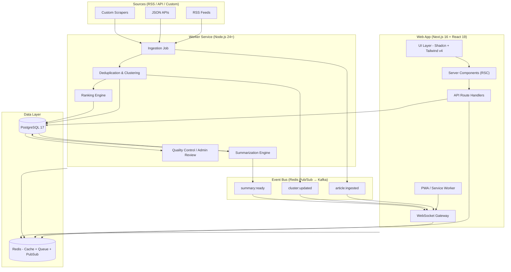
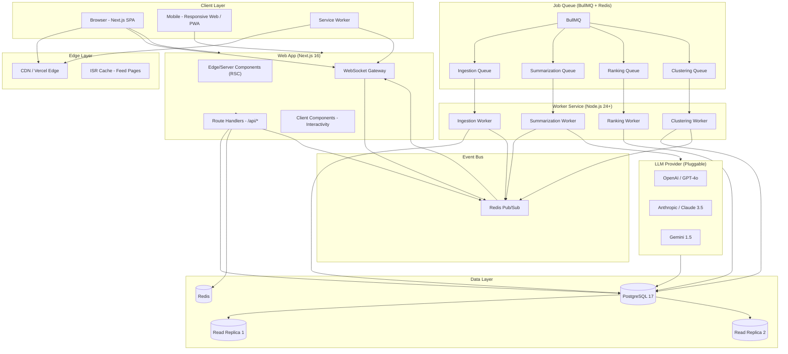
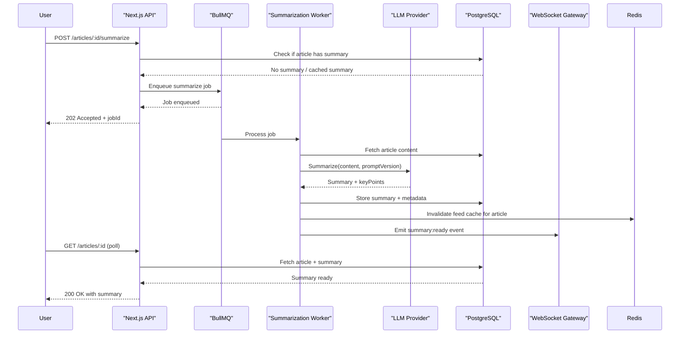
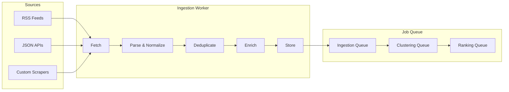

# OneStopNews · Project Architecture Document

> **Version:** 3.0 Re-imagined · **Status:** Architecture Baseline for Production Engineering  
> **Author:** Claw Code — Frontend Architect & Technical Partner  
> **Date:** 2026-06-08  
> **Classification:** Internal — Engineering, Product, Design, Operations, Security

---

## Table of Contents

| # | Section | Purpose |
|---|---------|---------|
| 1 | [Executive Summary](#1-executive-summary) | What, why, and how — the architecture in one page |
| 2 | [Product Vision & Positioning](#2-product-vision--positioning) | Long-term strategic direction and competitive moat |
| 3 | [Conceptual Architecture](#3-conceptual-architecture) | Domain philosophy, mental model, bounded contexts |
| 4 | [Target Users & Personas](#4-target-users--personas) | Who we build for, with behavioral data |
| 5 | [Information Architecture](#5-information-architecture) | Taxonomy, navigation, routing, dark mode, PWA |
| 6 | [Story Cluster Architecture](#6-story-cluster-architecture) | The core differentiator — first-class domain object |
| 7 | [System Architecture](#7-system-architecture) | Modular monolith + Worker + Queue + EDA + WebSocket |
| 8 | [Data Model & Storage Strategy](#8-data-model--storage-strategy) | PostgreSQL schema, partitioning, retention, GDPR |
| 9 | [API Design](#9-api-design) | Contract-first REST, WebSocket events, rate limiting |
| 10 | [Frontend Architecture](#10-frontend-architecture) | Next.js 16 App Router, PWA, testing, Storybook |
| 11 | [Design System](#11-design-system) | Editorial-industrial visual language, dark mode, motion |
| 12 | [AI Summary System](#12-ai-summary-system) | Summarization pipeline, multi-model evaluation, governance |
| 13 | [Ingestion & Deduplication Pipeline](#13-ingestion--deduplication-pipeline) | RSS/API → Normalize → Deduplicate → Persist |
| 14 | [Ranking & Impact Scoring](#14-ranking--impact-scoring) | Weighted composite formula, A/B testing framework |
| 15 | [Search & Discovery Architecture](#15-search--discovery-architecture) | V1 Postgres FTS → V2 Meilisearch → V3 OpenSearch |
| 16 | [Caching Strategy](#16-caching-strategy) | Four-layer cache with explicit invalidation triggers |
| 17 | [Security & Compliance](#17-security--compliance) | OWASP 2025, CSP exact config, GDPR, AI safety |
| 18 | [Observability & Operations](#18-observability--operations) | SLO/SLA, metrics, logging, tracing, alerting, runbooks |
| 19 | [Performance & Scalability](#19-performance--scalability) | Latency targets, horizontal scaling, multi-region |
| 20 | [Testing Strategy](#20-testing-strategy) | Unit, integration, contract, E2E, visual regression |
| 21 | [Rollout Plan & Roadmap](#21-rollout-plan--roadmap) | Phased delivery with milestone gates and go/no-go criteria |
| 22 | [Risk Register](#22-risk-register) | Threats, impact, probability, mitigation, contingency |
| 23 | [Appendices](#23-appendices) | TDRs, Glossary, Deployment Playbook |

---

## 1. Executive Summary

OneStopNews is a **topic-first, story-centric news intelligence platform** that helps people understand what is happening in the world by organizing information around events and topics rather than publishers and feeds.

> **Core Principle:** *"Everything important, sorted by topic."*

The architecture is designed as a **modular monolith with event-driven extensions** — deliberately rejecting premature microserviceization while building in the hooks for eventual decomposition. It balances fast delivery and developer velocity with enterprise-grade reliability, observability, and scaling headroom.

### What Makes This Architecture Different

| Dimension | Conventional News Aggregator | OneStopNews |
|-----------|------------------------------|-------------|
| **Organization** | By publisher/source | By **topic + story cluster** |
| **Unit of Consumption** | Individual article | **Event cluster** (multi-source story) |
| **AI Role** | AI-generated content / replacement | **AI-assisted compression** (optional, on-demand) |
| **Design** | Generic SaaS dashboards, purple gradients | **Editorial-industrial terminal** — calm, dense, premium |
| **Information Density** | Card grids with generous whitespace | **Story maps** with progressive density |
| **Trust Model** | Opaque algorithms | **Source-transparent, auditable, publisher-first** |
| **Offline Capability** | None | **PWA with offline feed caching** |
| **Real-Time Updates** | Page refresh required | **WebSocket push for live story clusters** |

### Architecture at a Glance



### Key Architectural Decisions (Summary)

| Decision | Choice | Rationale |
|----------|--------|-----------|
| Architecture Style | Modular monolith + EDA hooks | Small team, fast iteration, lower ops complexity. Can decompose later. |
| Database | PostgreSQL 17 | Strong relational model, excellent FTS, mature tooling |
| Queue | BullMQ + Redis | Native TypeScript, retry/priority, strong Next.js ecosystem |
| Event Bus | Redis Pub/Sub → Kafka | Start simple, migrate to Kafka at scale |
| Frontend | Next.js 16 RSC + Client Components | 80%+ Server Components, minimal client JS |
| Real-Time | WebSocket gateway | Push updates for live clusters, summary completion |
| Offline | PWA with Service Worker | Daily-use product needs offline resilience |
| AI Provider | Pluggable (OpenAI, Anthropic, Gemini) | No vendor lock-in, cost optimization, quality comparison |

---

## 2. Product Vision & Positioning

### 2.1 Vision Statement

> *"Become the fastest and most trusted way to understand important news by organizing information around stories instead of publishers."*

### 2.2 Strategic Positioning

OneStopNews occupies a unique position in the market — between **Google News** (algorithmic, noisy) and **Feedly** (power-user, source-centric), with the **editorial density of a newsroom terminal** and the **calm UX of a premium reading product**.

| Competitor | Strength | OneStopNews Differentiation |
|------------|----------|----------------------------|
| **Google News** | Scale, speed, story clustering | Topic-first IA, editorial density, cluster intelligence, source transparency |
| **Ground News** | Bias transparency, source comparison | Less political framing, calmer UX, AI-optional design |
| **Feedly** | Power-user monitoring, RSS mastery | Consumer-first, no RSS literacy required, story-centric |
| **SmartNews** | Mobile scan efficiency | Information density, desktop-class experience, cross-device sync |
| **Inoreader** | Enterprise RSS, rules engine | Not an RSS reader — topic-first by default, AI-assisted |
| **Artifact (RIP)** | AI-powered discovery, clean UX | Story-first (not article-first), source-respectful, publisher-linked |
| **Perplexity** | AI search, citation-rich | News-specific, topic-organized, not query-driven |

### 2.3 Core Product Principles

| Principle | Meaning | Architectural Implication |
|-----------|---------|---------------------------|
| **Topic First** | Topics are the primary navigation axis. Sources are secondary metadata. | Category/subcategory database-driven taxonomy, not hard-coded |
| **Story First** | Events matter more than individual articles. A story cluster is the atomic unit. | StoryCluster as first-class domain object, article belongs to cluster |
| **AI Optional** | AI summarizes, compresses, and assists — it does not replace original journalism. | On-demand summarization, clear opt-out, summary never primary content |
| **Source Respectful** | Every article links to the original publisher. Full articles never republished. | Content availability flag, excerpt-only storage, prominent source CTA |
| **Scan Optimized** | Users should understand major developments without reading every story. | Lead story + dense grid, progressive density, cluster overview |
| **Trust Through Transparency** | Source visible, AI labeled, algorithms auditable. | Provenance tracking, admin review, public methodology |
| **Calm & Dense** | Information-rich without overwhelm. Whitespace is structural, not decorative. | Editorial-industrial design system, intentional typography hierarchy |
| **Always Available** | News does not stop. The product should not either. | PWA offline mode, background sync, resilient ingestion |

### 2.4 Competitive Moat

OneStopNews builds defensibility through:

1. **Story Cluster Intelligence** — Proprietary clustering algorithm + human-in-the-loop curation creates data moat
2. **Editorial-Industrial Design** — Distinctive visual identity that competitors cannot easily replicate
3. **Source Relationships** — Transparent attribution builds publisher trust, enabling deeper integrations
4. **AI Governance Reputation** — Industry-leading transparency and quality controls differentiate from "AI slop"
5. **Daily Habit Formation** — PWA + offline + push notifications create retention loop

---

## 3. Conceptual Architecture

### 3.1 The OneStopNews Mental Model

```
+---------------------------------------------------------+
|                    OneStopNews                            |
|-------------- Over: News Layer -------------------------|
|  +---------+ +---------+ +---------+ +-----------+   |
|  |   Top   | |   Tech  | | Finance | |  Politics |   |
|  | Stories | |  News   | |  News   | |   News    |   |
|  +----+----+ +----+----+ +----+----+ +-----+-----+   |
|       |           |           |             |            |
|  +----v------------v------------v---------------v-----+ |
|  |              Story Clusters                        | |
|  |  "Apple Announces AI Strategy" (32 sources)       | |
|  |  "Singapore Housing Policy Shift" (14 sources)    | |
|  |  "Nvidia Earnings Beat" (21 sources)               | |
|  +----------------------------------------------------+ |
|  +----------------------------------------------------+ |
|  |              Article Detail                         | |
|  |  AI Summary | Original Source | Key Takeaways      | |
|  +----------------------------------------------------+ |
+---------------------------------------------------------+
```

### 3.2 Domain-Driven Design Overview

The architecture maps to five bounded contexts:

| Bounded Context | Responsibility | Key Entities | Deployable |
|-----------------|----------------|--------------|------------|
| **Ingestion** | Fetch, normalize, deduplicate | Source, IngestionJob, Article, FeedItem | Worker |
| **Clustering** | Group related articles into stories | StoryCluster, ClusterMembership, Topic | Worker |
| **Summarization** | AI compression with governance | Summary, SummaryVersion, PromptTemplate, ModelConfig | Worker |
| **Presentation** | Feed rendering, search, admin | User, UserPreference, FeedSlice, AdminAction | Web App |
| **Analytics** | Event tracking, metrics, reporting | AnalyticsEvent, UserSession, EngagementMetric | Both |

### 3.3 Event-Driven Architecture (EDA) Layer

While the core system is a modular monolith, critical workflows are **event-driven** to enable:
- Loose coupling between ingestion and presentation
- Real-time updates to connected clients
- Future decomposition into microservices
- Audit trails and replay capability

#### Core Events

| Event | Producer | Consumers | Payload |
|-------|----------|-----------|---------|
| `article:ingested` | Ingestion Worker | Clustering Worker, Analytics, WebSocket Gateway | `{ articleId, sourceId, categoryId, timestamp }` |
| `article:clustered` | Clustering Worker | Ranking Worker, Feed Cache Invalidator | `{ articleId, clusterId, confidenceScore }` |
| `cluster:updated` | Clustering Worker | WebSocket Gateway, Feed Pre-computer | `{ clusterId, articleCount, sourceCount, importanceScore }` |
| `summary:requested` | Web App API | Summarization Worker | `{ articleId, userId, requestedAt }` |
| `summary:completed` | Summarization Worker | WebSocket Gateway, Feed Cache Invalidator | `{ articleId, summaryId, modelName, tokenUsage }` |
| `summary:flagged` | Admin Dashboard | Summarization Worker, Alerting | `{ summaryId, reason, flaggedBy }` |
| `source:health_changed` | Ingestion Worker | Admin Dashboard, Alerting | `{ sourceId, oldStatus, newStatus, errorCount }` |

#### Event Bus Evolution

```
Phase 1 (MVP): Redis Pub/Sub
  → Simple, fast, no persistence
  → Sufficient for <100 events/sec
  → Lost events acceptable (idempotent workers)

Phase 2 (Scale): Redis Streams
  → Persistent, consumer groups
  → Replay capability
  → Backpressure handling

Phase 3 (Enterprise): Apache Kafka
  → Partitioned, replicated
  → Exactly-once semantics
  → Schema registry (Avro)
  → Multi-region replication
```

---

## 4. Target Users & Personas

### 4.1 Persona 1: Daily Scanner (Highest Priority)

> *"I check news 3-5 times a day. I want to know what is important without reading everything."*

| Attribute | Detail |
|-----------|--------|
| **Behavior** | Opens app multiple times, skims headlines, reads 1-2 full articles per session |
| **Needs** | Fast scanning, topic filtering, minimal cognitive load, offline access |
| **Device** | 70% mobile, 30% desktop |
| **Goals** | Stay informed with minimal time investment |
| **Pain Points** | Tab overload, algorithmic noise, clickbait, slow loading |
| **Success Metric** | DAU, sessions/day, time-to-understand |

### 4.2 Persona 2: Curious Professional (High Priority)

> *"I follow tech and finance closely. I need to understand trends, not just headlines."*

| Attribute | Detail |
|-----------|--------|
| **Behavior** | Reads summaries frequently, uses search, follows specific subcategories |
| **Needs** | AI compression, reliable topic groupings, source diversity, search |
| **Device** | 50/50 desktop/mobile |
| **Goals** | Efficient industry awareness for professional context |
| **Pain Points** | Information overload, shallow coverage, biased aggregation |
| **Success Metric** | Summary usage rate, search queries/session, topic exploration depth |

### 4.3 Persona 3: Enthusiast (Medium Priority)

> *"I read deeply about specific topics. I want niche coverage and historical context."*

| Attribute | Detail |
|-----------|--------|
| **Behavior** | Long reading sessions, uses search heavily, explores deep archives |
| **Needs** | Search, topic depth, read-later, saved searches, entity tracking |
| **Device** | Primarily desktop |
| **Goals** | Deep expertise and historical trend analysis |
| **Pain Points** | Poor archive search, no entity tracking, limited personalization |
| **Success Metric** | Time-on-page, read-later usage, saved search count |

### 4.4 Persona 4: Editor / Admin

> *"I manage sources, monitor system health, and ensure content quality."*

| Attribute | Detail |
|-----------|--------|
| **Behavior** | Monitors dashboards, adjusts source configurations, reviews AI outputs |
| **Needs** | Source CRUD, ingestion health dashboards, summary QA, cost monitoring |
| **Device** | Desktop primarily |
| **Goals** | Operational excellence and content integrity |
| **Pain Points** | No visibility into AI quality, source failures go unnoticed |
| **Success Metric** | Source uptime, summary flag rate, ingestion lag |

---

## 5. Information Architecture

### 5.1 Taxonomy Strategy

The content taxonomy is **curated but dynamic** — editors seed categories, but the system adapts based on clustering and entity extraction.

#### Top-Level Categories

| Category | Slug | Subcategories (examples) | Color Token | Gradient |
|----------|------|---------------------------|-------------|----------|
| **Top Stories** | `top` | All top stories, Breaking, Editor's picks | `#151719` | `linear-gradient(135deg, #151719, #334155)` |
| **Local News** | `local` | Singapore transport, housing, local business | `#405247` | `linear-gradient(135deg, #405247, #b86f52)` |
| **Tech News** | `tech` | Apple & devices, AI & ML, startups, cybersecurity | `#243b55` | `linear-gradient(135deg, #243b55, #64786a)` |
| **Global News** | `global` | China, US, Asia-Pacific, Europe, Middle East | `#334155` | `linear-gradient(135deg, #334155, #486b8f)` |
| **Finance News** | `finance` | Markets, earnings, personal finance, crypto | `#2f3a2f` | `linear-gradient(135deg, #2f3a2f, #c6a15b)` |
| **Politics News** | `politics` | SG politics, US politics, China politics, geopolitics | `#3f3446` | `linear-gradient(135deg, #3f3446, #8d5a4a)` |
| **Culture** | `culture` | Entertainment, K-culture, internet culture, sports | `#6d637e` | `linear-gradient(135deg, #6d637e, #b86f52)` |

> **Design Decision:** "Gossip" was renamed to "Culture" for broader appeal, advertiser friendliness, and brand positioning.

#### Dynamic Topics (Entity Model — Roadmap)

Beyond static categories, the system supports **entity extraction** for dynamic topic surfacing:
- **Named entities:** Apple, Nvidia, Trump, Singapore Airlines
- **Domain-specific topics:** AI regulation, EV adoption, interest rates
- **Trending clusters:** Auto-detected from velocity and coverage volume

```typescript
interface Entity {
  id: EntityId;
  name: string;
  slug: string;
  type: 'company' | 'person' | 'location' | 'topic' | 'event';
  categoryIds: CategoryId[];
  articleCount: number;
  clusterCount: number;
  trendingScore: number;
  createdAt: Date;
  updatedAt: Date;
}
```

### 5.2 Navigation Architecture

```
+--------------------------------------------------------+
| [Brand]  [Topic Nav Ribbon]  [Search]  [Settings]   |
+--------------------------------------------------------+
| +-------------+ +------------------------+ +-------+   |
| |  Topic Menu | |   Feed (Lead + Grid)   | |Detail |   |
| |             | |                        | |Panel  |   |
| |  Top        | | +------------------+   | |       |   |
| |  Local ▶    | | |   Lead Story     |   | | AI    |   |
| |  Tech ▶     | | | [Summary Toggle] |   | |Summary|   |
| |  Global ▶   | | +------------------+   | |       |   |
| |  Finance ▶  | | +----+ +----+ +----+ | |       |   |
| |  Politics ▶ | | |Art | |Art | |Art | | |       |   |
| |  Culture ▶  | | |icle| |icle| |icle| | |       |   |
| +-------------+ | +----+ +----+ +----+ | |       |   |
|                 |                        | |       |   |
|                 +------------------------+ +-------+   |
|  Desktop (≥1220px) — Three-Zone Layout               |
+--------------------------------------------------------+

+-------------------------+
| [Brand] [Topic Nav]     |
+-------------------------+
| Controls + Filters      |
+-------------------------+
| Feed (Single Column)    |
|                         |
| +---------------------+ |
| |   Lead Story        | |
| +---------------------+ |
| +-----+ +-----+       |
| |Card | |Card │ ...   |
| +-----+ +-----+       |
+-------------------------+
  Mobile + Tablet — Stacked Layout
```

### 5.3 URL & Routing Schema

| URL | Description | RSC / Client |
|-----|-------------|--------------|
| `/` | Default feed — Top Stories / All | RSC |
| `/topics/[category]` | Category default subcategory | RSC |
| `/topics/[category]/[subcategory]` | Filtered feed | RSC |
| `/article/[id]` | Standalone article detail (deep link) | RSC + Client (summary toggle) |
| `/search?q=...` | Search results | RSC |
| `/admin` | Admin dashboard (protected) | Client (heavy interactivity) |
| `/admin/sources` | Source management (protected) | Client |
| `/admin/ingestion` | Ingestion monitoring (protected) | Client |
| `/admin/summaries` | Summary QA (protected) | Client |
| `/admin/analytics` | Product analytics (protected) | Client |

### 5.4 Progressive Web App (PWA) & Offline Strategy

OneStopNews is a **daily-use product**. Users expect it to work even with intermittent connectivity.

#### PWA Manifest

```json
{
  "name": "OneStopNews",
  "short_name": "OSN",
  "description": "Everything important, sorted by topic",
  "start_url": "/",
  "display": "standalone",
  "background_color": "#f6f3ec",
  "theme_color": "#121416",
  "icons": [
    { "src": "/icon-192.png", "sizes": "192x192" },
    { "src": "/icon-512.png", "sizes": "512x512" }
  ]
}
```

#### Service Worker Strategy

```
+---------------------------------------------------------+
| Service Worker (Workbox)                                |
+---------------------------------------------------------+
| Precache:                                               |
|   - Shell HTML/CSS/JS                                   |
|   - Design system assets (fonts, icons)                 |
|   - Static landing page assets                          |
|                                                         |
| Runtime Cache Strategies:                               |
|   - API responses: NetworkFirst, 5 min cache            |
|   - Feed data: StaleWhileRevalidate, 2 min cache        |
|   - Article detail: NetworkFirst, 10 min cache          |
|   - Images: CacheFirst, 7 days                          |
|                                                         |
| Background Sync:                                        |
|   - Summary requests queued when offline                |
|   - Preference changes queued when offline              |
|                                                         |
| Push Notifications:                                     |
|   - Breaking story alerts (opt-in)                      |
|   - Summary ready notifications                         |
+---------------------------------------------------------+
```

#### Offline Behavior

| Scenario | Behavior |
|----------|----------|
| No network, cached feed available | Show cached feed with "Last updated X min ago" banner |
| No network, no cache | Show offline empty state with "Reconnecting..." |
| Network returns | Auto-refresh feed, dismiss banner |
| Summary requested offline | Queue request, show "Will summarize when online" |

### 5.5 Dark Mode Strategy

```css
/* Light mode (default) */
:root {
  --paper: #f6f3ec;
  --surface: #fffdf8;
  --ink: #121416;
  --ink-light: #56616f;
  --border: rgba(18, 20, 22, 0.08);
}

/* Dark mode */
[data-theme="dark"] {
  --paper: #0f1113;
  --surface: #1a1d21;
  --ink: #e8e4dc;
  --ink-light: #9ca3af;
  --border: rgba(255, 255, 255, 0.08);
}
```

- **Default:** System preference (`prefers-color-scheme`)
- **Override:** User toggle in settings, persisted to `localStorage` + server
- **Transition:** Smooth 300ms CSS transition on all color properties
- **Images:** Use `filter: brightness(0.9)` on article images in dark mode
- **Charts:** Invert chart colors, use darker accent variants


---

## 6. Story Cluster Architecture

> **ARCHITECTURAL DECISION: Story Clusters are a first-class domain object. This is the single highest-impact design choice in the OneStopNews platform.**

### 6.1 Why Story Clusters Matter

Users think: *"What is happening with Apple?"*  
Not: *"What did Reuters publish?"*

Story clusters transform the platform from an **article reader** into a **news intelligence terminal**.

### 6.2 Story Cluster Schema

```typescript
interface StoryCluster {
  id: ClusterId;
  title: string;                    // Representative headline
  slug: string;                     // URL-safe identifier
  summary?: string;                 // Brief cluster overview
  categoryId: CategoryId;
  subcategoryId?: SubcategoryId;
  topicIds?: TopicId[];
  entityIds?: EntityId[];           // Named entities in this cluster

  // Scoring
  importanceScore: number;         // Composite: recency x authority x coverage
  trendDirection: 'rising' | 'stable' | 'falling' | 'breaking';
  velocityScore: number;           // Articles per hour

  // Coverage
  articleCount: number;
  sourceCount: number;
  sourceDiversity: number;           // 0-1 score (Shannon entropy)
  geographicSpread?: string[];       // Countries/regions covered

  // Timestamps
  firstArticleAt: Date;
  lastArticleAt: Date;
  peakActivityAt?: Date;           // When coverage peaked

  // AI
  clusterSummary?: ClusterSummary;  // AI-generated cluster overview
  sentimentScore?: number;          // -1 to 1 aggregate sentiment

  // Status
  status: 'active' | 'merged' | 'archived' | 'breaking';
  mergedIntoId?: ClusterId;

  createdAt: Date;
  updatedAt: Date;
}

interface ClusterMembership {
  id: string;
  clusterId: ClusterId;
  articleId: ArticleId;
  similarityScore: number;          // TF-IDF or embedding similarity
  isLeadArticle: boolean;           // Best representative article
  addedAt: Date;
}

interface ClusterSummary {
  overview: string;
  keyDevelopments: string[];        // Timeline of developments
  sourcePerspectives: {              // How different sources frame it
    sourceName: string;
    angle: string;
  }[];
  generatedAt: Date;
  modelName: string;
  modelVersion: string;
}
```

### 6.3 Clustering Algorithm (V1 — Similarity-Based)

```
+---------------------------------------------------------+
| Clustering Pipeline                                     |
+---------------------------------------------------------+
| 1. INGEST → Article lands in database                 |
|    ↓                                                    |
| 2. DEDUPLICATE → Canonical URL + Content Hash           |
|    ↓                                                    |
| 3. PREPROCESS → Tokenize title, extract entities        |
|    ↓                                                    |
| 4. SIMILARITY SCORING →                                |
|    a. Title similarity: Jaccard index > 0.6             |
|    b. Entity overlap: Shared named entities ≥ 2         |
|    c. Time proximity: |t1 - t2| < 24 hours            |
|    d. Category match: Same category/subcategory        |
|    ↓                                                    |
| 5. CLUSTER ASSIGNMENT →                                |
|    IF similarity_score > threshold (0.75):             |
|      → Add to existing cluster                          |
|    ELSE:                                                |
|      → Create new cluster                               |
|    ↓                                                    |
| 6. CLUSTER MERGE → Check for overlapping clusters       |
|    IF two clusters share > 50% articles:                |
|      → Merge into larger cluster                        |
|    ↓                                                    |
| 7. IMPORTANCE SCORING → Composite ranking              |
|    ↓                                                    |
| 8. PERSIST → Store cluster + memberships               |
|    ↓                                                    |
| 9. EMIT EVENT → cluster:updated                         |
+---------------------------------------------------------+
```

### 6.4 Clustering Algorithm (V2 — Embedding-Based, Roadmap)

```
Phase 2 Enhancement:
  - Generate sentence embeddings for each article title + excerpt
  - Use HDBSCAN for density-based clustering
  - Semantic similarity threshold: cosine > 0.82
  - Cross-lingual clustering via multilingual embeddings
  - Temporal decay: older articles have lower cluster affinity
```

---

## 7. System Architecture

### 7.1 High-Level Component Diagram



### 7.2 Internal Layering (Clean Architecture)

Within each deployable (Web App and Worker), code follows **layered architecture** with feature-based organization:

```
+---------------------------------------------------------+
| UI Layer (apps/web only)                                |
| ├─ Shadcn components + design system                    |
| ├─ Feature-specific layouts                             |
| ├─ Server/Client Component boundaries                   |
| ├─ PWA shell (service worker integration)               |
| └─ 80%+ Server Components (RSC)                         |
+---------------------------------------------------------+
| Application Layer                                       |
| ├─ Route Handlers (Next.js API routes)                  |
| ├─ Server Actions                                       |
| ├─ RSC Data Loaders                                     |
| ├─ WebSocket event handlers                            |
| ├─ Job Enqueuing (ingestion, summarization triggers)  |
| └─ Domain Service Orchestration                        |
+---------------------------------------------------------+
| Domain Layer (packages/domain)                          |
| ├─ Core business logic ZERO framework dependencies      |
| ├─ Articles, Sources, Summaries, Ranking, Clusters      |
| ├─ Pure TypeScript functions/classes                    |
| └─ Unit testable, reusable across web + worker          |
+---------------------------------------------------------+
| Infrastructure Layer                                    |
| ├─ packages/db: ORM, queries, migrations, connection    |
| ├─ packages/config: env, logging, queue clients         |
| ├─ packages/cache: Redis client, cache strategies       |
| ├─ packages/events: Event bus abstraction              |
| └─ External: PostgreSQL, Redis, LLM API               |
+---------------------------------------------------------+
```

### 7.3 WebSocket Gateway

Real-time updates are pushed to connected clients via a WebSocket gateway:

```typescript
// WebSocket event types
interface WSEvents {
  'cluster:updated': { clusterId: string; importanceScore: number; articleCount: number };
  'summary:ready': { articleId: string; summaryId: string };
  'feed:refresh': { categoryId: string; reason: 'new_article' | 'summary_ready' };
  'source:alert': { sourceId: string; status: 'degraded' | 'offline' };
}

// Connection strategy
// - One WebSocket per client session
// - Subscribe to category-specific channels
// - Reconnect with exponential backoff
// - Fallback to polling if WebSocket unavailable
```

---

## 8. Data Model & Storage Strategy

### 8.1 Core Entity Diagram

```mermaid
erDiagram
    USER ||--o{ USER_PREFERENCE : has
    USER ||--o{ READ_LATER : saves
    USER ||--o{ USER_SESSION : creates
    CATEGORY ||--o{ SUBCATEGORY : contains
    SUBCATEGORY ||--o{ TOPIC : contains
    SOURCE ||--o{ ARTICLE : publishes
    SOURCE ||--o{ SOURCE_HEALTH_SNAPSHOT : has
    ARTICLE }o--|| STORY_CLUSTER : belongs_to
    ARTICLE ||--o{ ARTICLE_METRICS : has
    ARTICLE ||--o--| SUMMARY : has
    SUMMARY ||--o{ SUMMARY_VERSION : tracks
    STORY_CLUSTER ||--o{ CLUSTER_MEMBERSHIP : contains
    STORY_CLUSTER ||--o{ CLUSTER_METRICS : has
    STORY_CLUSTER ||--o{ TOPIC : tagged_with
    STORY_CLUSTER ||--o{ ENTITY : mentions
    INGESTION_JOB ||--o{ ARTICLE : produces
    FEED_SLICE ||--o{ ARTICLE : references
    ANALYTICS_EVENT }o--|| USER : generated_by
```

### 8.2 Primary Entities

#### Source
```typescript
interface Source {
  id: SourceId;
  name: string;
  type: 'rss' | 'atom' | 'json_api' | 'custom';
  url: string;
  feedUrl?: string;
  apiConfig?: Record<string, unknown>;
  pollIntervalMinutes: number;      // 5-30 min depending on priority
  priority: number;                 // 1-10, affects scheduling and ranking weight
  status: 'online' | 'degraded' | 'offline' | 'paused';
  lastSuccessAt?: Date;
  lastErrorAt?: Date;
  lastError?: string;
  errorCount: number;               // Rolling 24h error count
  defaultCategoryId: CategoryId;
  language: string;                 // ISO 639-1
  country?: string;                 // ISO 3166-1 alpha-2
  trustScore: number;              // 0-1, editorial reputation
  createdAt: Date;
  updatedAt: Date;
}
```

#### Article
```typescript
interface Article {
  id: ArticleId;
  sourceId: SourceId;
  canonicalUrl: string;
  normalizedUrl: string;
  contentHash: string;               // SHA-256 of title + excerpt

  title: string;
  normalizedTitle: string;           // Lowercase, stemmed for dedup
  excerpt?: string;
  content?: string;                  // Fair-use excerpt or full text
  contentAvailability: 'title' | 'excerpt' | 'partial' | 'full';

  categoryId: CategoryId;
  subcategoryId?: SubcategoryId;
  topicIds?: TopicId[];
  entityIds?: EntityId[];

  // Clustering
  storyClusterId?: ClusterId;
  clusterMembershipId?: string;

  // Content
  language: string;
  publishedAt: Date;
  fetchedAt: Date;

  // Media
  imageUrl?: string;
  author?: string;
  tags?: string[];

  // Scoring
  importanceScore: number;

  // Summary
  hasSummary: boolean;
  summaryStatus: 'none' | 'pending' | 'ok' | 'needs_review' | 'failed';

  // Status
  status: 'active' | 'archived' | 'removed';

  createdAt: Date;
  updatedAt: Date;
}
```

#### StoryCluster
```typescript
interface StoryCluster {
  id: ClusterId;
  title: string;
  slug: string;
  summary?: string;
  categoryId: CategoryId;
  subcategoryId?: SubcategoryId;
  topicIds?: TopicId[];
  entityIds?: EntityId[];

  // Scoring
  importanceScore: number;
  trendDirection: 'rising' | 'stable' | 'falling' | 'breaking';
  velocityScore: number;

  // Coverage
  articleCount: number;
  sourceCount: number;
  sourceDiversity: number;

  // Timestamps
  firstArticleAt: Date;
  lastArticleAt: Date;

  // AI
  clusterSummary?: ClusterSummary;
  sentimentScore?: number;

  // Status
  status: 'active' | 'merged' | 'archived' | 'breaking';
  mergedIntoId?: ClusterId;

  createdAt: Date;
  updatedAt: Date;
}
```

#### Summary
```typescript
interface Summary {
  id: SummaryId;
  articleId: ArticleId;

  // Content
  summaryText: string;
  keyPoints: string[];
  whyItMatters?: string;

  // AI Provenance
  basedOn: string;                   // What content was summarized
  modelName: string;
  modelVersion: string;
  promptVersion: string;            // Prompt template version
  promptHash: string;                // SHA-256 of prompt for reproducibility
  tokenUsage: { prompt: number; completion: number };

  // Quality
  confidenceScore?: number;          // Model confidence if available
  factualityScore?: number;         // Automated fact-check score

  // Governance
  status: 'ok' | 'needs_review' | 'disabled' | 'failed';
  generatedAt: Date;
  reviewedAt?: Date;
  reviewedBy?: UserId;
  reviewNotes?: string;

  // Audit
  generationDurationMs: number;
  retryCount: number;

  createdAt: Date;
  updatedAt: Date;
}
```

#### FeedSlice (Pre-computed Feed Cache)
```typescript
interface FeedSlice {
  id: string;
  key: string;                       // "category:tech:sub:ai:sort:latest"
  articleIds: string[];              // Ordered list of article IDs
  clusterIds: string[];            // Parallel cluster IDs
  totalCount: number;
  computedAt: Date;
  expiresAt: Date;

  // Metadata
  computationDurationMs: number;
  sourceVersion: string;             // Schema version for cache invalidation
}
```

### 8.3 Indexing Strategy

| Table | Index | Purpose |
|-------|-------|---------|
| `Article` | `(categoryId, publishedAt DESC)` | Primary feed queries |
| `Article` | `(subcategoryId, publishedAt DESC)` | Subcategory feed queries |
| `Article` | `(storyClusterId)` | Cluster membership lookups |
| `Article` | `GIN(fullTextSearch)` | PostgreSQL FTS on title/excerpt/content |
| `Article` | `(canonicalUrl)` (UNIQUE) | Deduplication |
| `Article` | `(contentHash)` | Near-duplicate detection |
| `Article` | `(fetchedAt)` | Ingestion monitoring |
| `StoryCluster` | `(categoryId, importanceScore DESC)` | Top cluster queries |
| `StoryCluster` | `(lastArticleAt DESC)` | Active cluster queries |
| `StoryCluster` | `(status, importanceScore DESC)` | Breaking news queries |
| `Summary` | `(articleId)` | Summary lookup |
| `Summary` | `(status, generatedAt DESC)` | QA dashboard queries |
| `IngestionJob` | `(sourceId, startedAt DESC)` | Source health monitoring |
| `Source` | `(status, lastSuccessAt)` | Stale source detection |
| `FeedSlice` | `(key)` (UNIQUE) | Cache key lookups |

### 8.4 Database Partitioning Strategy

At 100k articles/day, the `articles` table grows rapidly. Partitioning is essential.

```sql
-- Range partition by month
CREATE TABLE articles (
  id UUID PRIMARY KEY,
  -- ... all columns
  fetchedAt TIMESTAMP NOT NULL
) PARTITION BY RANGE (fetchedAt);

-- Create monthly partitions
CREATE TABLE articles_2026_06 PARTITION OF articles
  FOR VALUES FROM ('2026-06-01') TO ('2026-07-01');
CREATE TABLE articles_2026_07 PARTITION OF articles
  FOR VALUES FROM ('2026-07-01') TO ('2026-08-01');

-- Auto-create future partitions via cron job or trigger
```

| Table | Partition Strategy | Retention |
|-------|---------------------|-----------|
| `articles` | Range by `fetchedAt` (monthly) | 24 months active, archive to S3 after |
| `article_metrics` | Range by `date` (monthly) | 12 months |
| `analytics_events` | Range by `createdAt` (daily) | 90 days hot, 1 year cold |
| `ingestion_jobs` | Range by `startedAt` (monthly) | 6 months |
| `summaries` | Range by `generatedAt` (monthly) | 24 months |

### 8.5 Data Retention & GDPR Compliance

| Data Type | Retention Period | Action After |
|-----------|-----------------|--------------|
| User account | Until deletion request | Anonymize or delete |
| User preferences | Until deletion request | Delete with account |
| Read-later items | 90 days inactive | Soft delete |
| Search history | 30 days | Anonymize (remove user link) |
| Analytics events | 90 days hot, 1 year cold | Aggregate and delete raw |
| Article content | 24 months | Archive to S3, remove from DB |
| Summary content | 24 months | Archive to S3 |
| Ingestion logs | 6 months | Delete |

**GDPR Compliance Measures:**
- **Right to access:** Export all user data via `/api/user/export`
- **Right to erasure:** `/api/user/delete` — cascade delete or anonymize
- **Data portability:** Export in machine-readable format (JSON)
- **Consent tracking:** Explicit opt-in for analytics, push notifications
- **PII redaction:** All logs strip email, IP hashed
- **DPO contact:** Listed in privacy policy

### 8.6 PostgreSQL Configuration

- **Production:** PostgreSQL 17 with read replicas via AWS RDS / Neon / Supabase
- **Development:** PostgreSQL 17 Docker container (same version as production)
- **Migration Tool:** Prisma ORM with schema-first workflow
- **Connection Pooling:** PgBouncer in production (transaction mode)
- **Backup Strategy:** Automated daily snapshots + point-in-time recovery (PITR)
- **Monitoring:** pg_stat_statements for slow query detection


---

## 9. API Design

> **Principle:** APIs follow a **contract-first** approach. Every endpoint has typed input/output Zod schemas. Errors follow a single consistent format.

### 9.1 Error Response Format

```json
{
  "error": {
    "code": "VALIDATION_ERROR",
    "message": "Invalid sort parameter. Expected: 'latest', 'impact', 'summaryReady'",
    "details": {
      "field": "sort",
      "provided": "oldest",
      "allowed": ["latest", "impact", "summaryReady"]
    },
    "requestId": "req_abc123",
    "timestamp": "2026-06-08T12:00:00Z"
  }
}
```

### 9.2 Rate Limiting

| Endpoint | Limit | Window | Burst |
|----------|-------|--------|-------|
| `GET /api/v1/articles` | 100 | 1 min | 20 |
| `GET /api/v1/search` | 30 | 1 min | 10 |
| `POST /api/v1/articles/:id/summarize` | 10 | 1 min | 5 |
| `GET /api/v1/source-health` | 60 | 1 min | 15 |
| Admin endpoints | 300 | 1 min | 50 |

Implementation: Redis-backed token bucket via `rate-limiter-flexible`.

### 9.3 Public API Endpoints

#### Categories
```
GET /api/v1/categories
→ 200 OK
  {
    categories: [
      {
        id: string,
        label: string,
        slug: string,
        description: string,
        subcategories: [
          { id, label, slug, articleCount, storyCount }
        ],
        articleCount: number,
        storyCount: number,
        colorToken: string
      }
    ]
  }
```

#### Feed
```
GET /api/v1/articles
  ?category={slug}&subcategory={slug}&sort={latest|impact|summaryReady}
  &q={searchQuery}&page={number}&pageSize={number}&clusterView={boolean}
→ 200 OK
  {
    articles: ArticleDTO[],
    clusters: ClusterDTO[],       // Story cluster data for rendering
    counts: { total, category, subcategory },
    indexed: number,                // Total articles in system
    summarized: number,
    page: number,
    pageSize: number,
    totalPages: number,
    cachedAt: string                // For client cache validation
  }

GET /api/v1/articles/:id
→ 200 OK
  {
    article: ArticleDTO,
    summary?: SummaryDTO,
    cluster?: ClusterDTO,
    relatedArticles?: ArticleDTO[]
  }
```

#### Search
```
GET /api/v1/search
  ?q={query}&category={slug}&subcategory={slug}
  &sort={relevance|latest|impact}&page={number}&pageSize={number}
→ 200 OK
  {
    articles: ArticleDTO[],
    clusters: ClusterDTO[],
    suggestions: string[],         // "Did you mean?"
    total: number,
    page, pageSize, totalPages
  }
```

#### Summarization
```
POST /api/v1/articles/:id/summarize
→ 202 Accepted
  {
    jobId: string,
    status: 'pending',
    estimatedSeconds: number,
    queuePosition?: number
  }

GET /api/v1/summaries/:id/status
→ 200 OK
  {
    status: 'pending' | 'processing' | 'completed' | 'failed',
    summary?: SummaryDTO,
    error?: { code, message }
  }
```

#### Source Health
```
GET /api/v1/source-health
→ 200 OK
  {
    sources: SourceHealthDTO[],
    overall: {
      total: number,
      online: number,
      degraded: number,
      offline: number,
      avgLatencyMs: number
    }
  }
```

#### User Preferences
```
GET /api/v1/user/preferences
→ 200 OK { preferences: UserPreferenceDTO }

PATCH /api/v1/user/preferences
→ 200 OK { preferences: UserPreferenceDTO }
```

### 9.4 WebSocket API

```
CONNECT wss://api.onestopnews.com/ws
  Headers: { Authorization: Bearer <token> }

// Client → Server
SUBSCRIBE { channel: "feed:tech" }
SUBSCRIBE { channel: "feed:finance" }
SUBSCRIBE { channel: "summary:user_123" }

// Server → Client
EVENT {
  type: "cluster:updated",
  data: { clusterId, importanceScore, articleCount, categoryId }
}

EVENT {
  type: "summary:ready",
  data: { articleId, summaryId, generatedAt }
}

EVENT {
  type: "feed:refresh",
  data: { categoryId, reason: "new_article", articleCount }
}
```

### 9.5 Admin API Endpoints (protected, RBAC)

```
POST   /api/v1/admin/sources              → Create new source
PATCH  /api/v1/admin/sources/:id         → Update source configuration
POST   /api/v1/admin/sources/:id/enable   → Enable source
POST   /api/v1/admin/sources/:id/disable  → Disable source
DELETE /api/v1/admin/sources/:id          → Delete source (soft)

POST   /api/v1/admin/ingest             → Trigger ingestion (all or per-source)
GET    /api/v1/admin/ingestion/jobs       → List ingestion job history
GET    /api/v1/admin/ingestion/:id/logs  → Job logs

GET    /api/v1/admin/summaries          → Summary QA dashboard data
PATCH  /api/v1/admin/summaries/:id/review → Flag summary for review
POST   /api/v1/admin/summaries/:id/regen → Trigger summary regeneration

GET    /api/v1/admin/analytics          → Product analytics
GET    /api/v1/admin/costs              → AI cost breakdown

GET    /api/v1/admin/users              → User management
PATCH  /api/v1/admin/users/:id/role     → Update user role
```

---

## 10. Frontend Architecture

### 10.1 Technology Stack

| Layer | Technology | Version |
|-------|-----------|---------|
| Framework | Next.js | 16+ |
| Language | TypeScript | 5.6+ (strict mode) |
| UI Engine | React | 19+ |
| Styling | Tailwind CSS | v4 |
| Components | Shadcn UI | v4 (Radix primitives) |
| State | Server Components + URL state | — |
| Fetching | Server Actions + Route Handlers | — |
| Fonts | Newsreader (headlines) + Satoshi (UI) | — |
| Icons | Lucide React | latest |
| PWA | Workbox | v7 |
| Testing | Vitest + Playwright | latest |

### 10.2 Repository Structure

```text
apps/
  web/
    src/
      app/                          # Next.js App Router
        (marketing)/
          page.tsx                  # Landing page
          layout.tsx
          globals.css
        (app)/
          topics/
            [category]/
              [subcategory]/page.tsx
              [category]/page.tsx
          article/[id]/page.tsx
          search/page.tsx
          layout.tsx                # App shell, topic nav, detail panel
        api/                        # Route handlers
          v1/
            articles/route.ts
            categories/route.ts
            search/route.ts
            summarization/route.ts
            source-health/route.ts
            user/preferences/route.ts
            admin/
              sources/route.ts
              ingestion/route.ts
              summaries/route.ts
              analytics/route.ts
          ws/route.ts               # WebSocket upgrade handler
        sw.ts                       # Service Worker registration
      features/
        topics/                     # Topic navigation, category/subcategory logic
        feed/                       # Lead card, article grid, feed layout
        article-detail/             # Detail panel, summary toggle, source link
        search/                     # Search interface, filters, results
        admin/                      # Admin dashboard, source management
        landing/                    # Marketing landing page sections
      shared/
        components/                 # Shared low-level components
        hooks/                      # Reusable React hooks
        lib/                        # Utilities, helpers
        types/                      # Shared TypeScript types
    public/
      manifest.json
      sw.js
      icons/
    package.json
    tsconfig.json
    tailwind.config.ts
    next.config.ts

  worker/
    src/
      jobs/
        ingestion/
        summarization/
        ranking/
        clustering/
      services/
      workers/
    package.json

packages/
  domain/                           # Pure business logic (zero framework deps)
  db/                               # Prisma client, migrations, seed data
  ui/                               # Shadcn components, design system tokens
  config/                           # Shared env parsing, logging, constants
  cache/                            # Redis client, cache strategies
  events/                           # Event bus abstraction
  utils/                            # Date, string, format utilities
```

### 10.3 Server/Client Component Strategy

```
+---------------------------------------------------------+
| Next.js Page                                            |
| +---------------------------------------------------+   |
| | Server Component (RSC)                              |   |
| | +------------------------------------------+      |   |
| | | TopicNav (RSC)                           |      |   |
| | | ├─ CategorySSR                          |      |   |
| | | └─ SubcategorySSR                       |      |   |
| | +------------------------------------------+      |   |
| | +------------------------------------------+      |   |
| | | FeedShell (RSC)                          |      |   |
| | | ├─ Suspense                             |      |   |
| | | ├─ FeedHeader                           |      |   |
| | | │ ├─ SearchBar (client) ★            |      |   |
| | | │ └─ SortSelect (client) ★            |      |   |
| | | ├─ Suspense                             |      |   |
| | | ├─ LeadArticle (RSC)                   |      |   |
| | | └─ ArticleGrid (RSC)                   |      |   |
| | +------------------------------------------+      |   |
| | +------------------------------------------+      |   |
| | | DetailPanel (client) ★                   |      |   |
| | | ├─ Interactive                          |      |   |
| | | ├─ SummaryToggle                        |      |   |
| | | ├─ ArticleMetadata                      |      |   |
| | | ├─ SummaryView / OriginalView           |      |   |
| | | ├─ ActionButtons                        |      |   |
| | | └─ WebSocketListener                    |      |   |
| | +------------------------------------------+      |   |
| +---------------------------------------------------+   |
+---------------------------------------------------------+
  ★ = Client Component (interactivity, hooks, browser APIs)
```

### 10.4 PWA Implementation

```typescript
// next.config.ts
import withPWA from 'next-pwa';

export default withPWA({
  dest: 'public',
  register: true,
  skipWaiting: true,
  runtimeCaching: [
    {
      urlPattern: /^https:\/\/api\.onestopnews\.com\/api\/v1\/articles/,
      handler: 'NetworkFirst',
      options: {
        cacheName: 'feed-cache',
        expiration: { maxEntries: 50, maxAgeSeconds: 300 },
      },
    },
    {
      urlPattern: /^https:\/\/api\.onestopnews\.com\/api\/v1\/search/,
      handler: 'NetworkFirst',
      options: {
        cacheName: 'search-cache',
        expiration: { maxEntries: 20, maxAgeSeconds: 60 },
      },
    },
    {
      urlPattern: /\.(?:png|jpg|jpeg|svg|webp)$/,
      handler: 'CacheFirst',
      options: {
        cacheName: 'image-cache',
        expiration: { maxEntries: 100, maxAgeSeconds: 604800 },
      },
    },
  ],
});
```

---

## 11. Design System

### 11.1 Design Direction

**Concept:** "Editorial Intelligence Terminal"

Not:
- SaaS Dashboard
- AI Chat App
- Magazine Clone

Instead:
- Modern newspaper
- Research notebook
- Information terminal

### 11.2 Typography

```css
:root {
  /* Headlines: Editorial Serif */
  --font-headline: 'Newsreader', Georgia, 'Times New Roman', serif;
  --font-headline-weight: 700;
  --font-headline-leading: 0.95;

  /* UI: Modern Grotesk */
  --font-ui: 'Satoshi', -apple-system, BlinkMacSystemFont, system-ui, sans-serif;
  --font-ui-weight: 500;
  --font-ui-weight-bold: 700;

  /* Mono (for timestamps, code, metrics) */
  --font-mono: 'SF Mono', 'IBM Plex Mono', monospace;
}
```

| Element | Font | Size | Weight | Line-Height | Letter-Spacing |
|---------|------|------|--------|-------------|----------------|
| H1 (Hero) | Newsreader | clamp(48px, 8vw, 88px) | 800 | 0.92 | -0.02em |
| H2 (Section) | Newsreader | clamp(36px, 5vw, 56px) | 700 | 1.0 | -0.01em |
| H3 (Card Title) | Newsreader | clamp(20px, 3vw, 28px) | 700 | 1.1 | -0.01em |
| Body | Satoshi | 16px | 400 | 1.6 | 0 |
| UI Label | Satoshi | 13px | 600 | 1.4 | 0.02em |
| Caption | Satoshi | 12px | 500 | 1.4 | 0.01em |
| Mono | SF Mono | 13px | 400 | 1.5 | 0 |

### 11.3 Color Palette

#### Light Mode (Default)

```css
:root {
  /* Foundation */
  --paper: #f6f3ec;              /* Warm off-white background */
  --surface: #fffdf8;            /* Elevated surfaces */
  --ink: #121416;                /* Primary text */
  --ink-800: #262b31;            /* Secondary headings */
  --ink-600: #56616f;            /* Secondary text */
  --ink-400: #8994a3;            /* Tertiary/muted text */
  --ink-200: #c4cad3;            /* Disabled text */

  /* Accent */
  --moss: #4d6657;               /* Primary accent — trust, editorial */
  --moss-dark: #405247;
  --moss-light: #eef1ea;
  --moss-muted: rgba(77, 102, 87, 0.08);
  --clay: #a86a4a;               /* Secondary accent — warmth, urgency */
  --clay-light: #f5ece4;
  --slate: #526171;              /* Tertiary — tech, neutral */

  /* Functional */
  --border: #ddd8cc;             /* Subtle borders */
  --border-soft: #ece7db;        /* Lighter borders */
  --shadow-sm: 0 2px 8px rgba(18, 20, 22, 0.05);
  --shadow-md: 0 12px 40px rgba(18, 20, 22, 0.08);
  --shadow-lg: 0 24px 70px rgba(18, 20, 22, 0.12);

  /* Category Accents */
  --top-accent: #151719;
  --local-accent: #405247;
  --tech-accent: #243b55;
  --global-accent: #334155;
  --finance-accent: #2f3a2f;
  --politics-accent: #3f3446;
  --culture-accent: #6d637e;
}
```

#### Dark Mode

```css
[data-theme="dark"] {
  --paper: #0f1113;
  --surface: #1a1d21;
  --ink: #e8e4dc;
  --ink-800: #c8c4bc;
  --ink-600: #9ca3af;
  --ink-400: #6b7280;
  --ink-200: #4b5563;

  --moss: #6b8f7a;
  --moss-dark: #8ab89a;
  --moss-light: rgba(107, 143, 122, 0.15);
  --clay: #c98a6a;
  --clay-light: rgba(201, 138, 106, 0.15);

  --border: rgba(255, 255, 255, 0.08);
  --border-soft: rgba(255, 255, 255, 0.04);
}
```

### 11.4 Spacing System

| Token | Value | Usage |
|-------|-------|-------|
| `--space-xs` | 8px | Tight padding, icon gaps |
| `--space-sm` | 16px | Component internal padding |
| `--space-md` | 24px | Section internal padding |
| `--space-lg` | 48px | Section gaps |
| `--space-xl` | 80px | Major section spacing |
| `--space-2xl` | 120px | Hero/large section spacing |

### 11.5 Border Radius

| Token | Value | Usage |
|-------|-------|-------|
| `--radius-sm` | 4px | Small buttons, tags |
| `--radius` | 8px | Cards, inputs, buttons |
| `--radius-lg` | 12px | Large cards, modals |
| `--radius-full` | 9999px | Pills, avatars |

### 11.6 Animation & Motion System

```css
:root {
  /* Transitions */
  --transition-fast: 150ms cubic-bezier(0.4, 0, 0.2, 1);
  --transition-base: 240ms cubic-bezier(0.4, 0, 0.2, 1);
  --transition-slow: 420ms cubic-bezier(0.4, 0, 0.2, 1);
  --transition-slower: 600ms cubic-bezier(0.4, 0, 0.2, 1);

  /* Easing */
  --ease-out: cubic-bezier(0.4, 0, 0.2, 1);
  --ease-in-out: cubic-bezier(0.4, 0, 0.2, 1);
  --ease-spring: cubic-bezier(0.34, 1.56, 0.64, 1);
}
```

| Animation | Duration | Easing | Usage |
|-----------|----------|--------|-------|
| Hover state | 200ms | ease-out | Buttons, cards, links |
| Card lift | 240ms | ease-out | Article card hover |
| Modal open | 300ms | ease-spring | Detail panel, dialogs |
| Page transition | 400ms | ease-out | Route changes |
| Scroll reveal | 600ms | ease-out | Section entrance |
| Cluster rotation | 400ms | ease-out | Story cluster wall |
| Counter | 1800ms | ease-out-expo | Stat counters |

**Reduced Motion:** All animations respect `prefers-reduced-motion: reduce`.

### 11.7 Component Inventory

| Component | Source | Customization |
|-----------|--------|---------------|
| Button | Shadcn | Custom variants: primary (ink), secondary (outline), ghost |
| Card | Shadcn | Custom: article card, lead card, cluster card |
| Dialog | Shadcn | Custom: detail panel, admin modals |
| Dropdown | Shadcn | Custom: topic menu, sort select |
| Input | Shadcn | Custom: search bar, admin forms |
| Badge | Shadcn | Custom: source chip, summary ready, category tag |
| Tabs | Shadcn | Custom: summary/original toggle |
| Skeleton | Shadcn | Custom: feed loading states |
| Toast | Shadcn | Custom: action confirmations, errors |
| Toggle | Shadcn | Custom: dark mode, AI opt-out |
| ScrollArea | Shadcn | Custom: feed scroll, detail panel |
| Separator | Shadcn | Custom: section dividers |
| Tooltip | Shadcn | Custom: info tooltips |

**Custom Components (not in Shadcn):**
- `TopicNav` — Sticky topic navigation ribbon
- `ClusterStage` — Story cluster visualization
- `ArticleGrid` — Responsive article card grid
- `LeadCard` — Featured story card
- `SummaryPanel` — AI summary with toggle
- `SourceChip` — Publisher attribution badge
- `TrustBadge` — AI transparency indicator
- `FeedSkeleton` — Loading state for feed
- `OfflineBanner` — Offline mode indicator


---

## 12. AI Summary System

### 12.1 Architecture



### 12.2 Summary Structure

```
+---------------------------------------------------------+
| AI Summary                                              |
+---------------------------------------------------------+
| Overview (2-3 sentences)                                |
| "Apple announced an expanded enterprise AI strategy     |
| with new developer APIs and partnership programs."      |
|                                                         |
| Key Takeaways (3-7 bullets)                           |
| - Enterprise AI rollout expands to mid-market           |
| - Developer ecosystem growing with new APIs             |
| - Competitive pressure on Microsoft and Google        |
|                                                         |
| Why It Matters (1-2 sentences)                          |
| "This signals Apple's intent to become a serious      |
| enterprise AI player, not just a consumer brand."       |
|                                                         |
| AI-Generated - Verify with original                     |
| [Read Original] [Copy Summary]                        |
+---------------------------------------------------------+
```

### 12.3 Prompt Engineering

```typescript
interface PromptTemplate {
  id: string;
  name: string;
  version: string;
  purpose: 'summary' | 'key_points' | 'why_it_matters';
  systemPrompt: string;
  userPromptTemplate: string;
  maxTokens: number;
  temperature: number;
  modelRequirements: string[];
}

// Example: Summary prompt
const SUMMARY_PROMPT: PromptTemplate = {
  id: 'summary-v1',
  name: 'Article Summary',
  version: '1.0',
  purpose: 'summary',
  systemPrompt: `You are a professional news summarizer. Summarize the given article concisely and accurately. Focus on facts, not opinions. Maintain the original meaning. Do not add information not present in the source.`,
  userPromptTemplate: `Title: {{title}}
Excerpt: {{excerpt}}
Content: {{content}}

Provide a concise 2-3 sentence summary of this article.`,
  maxTokens: 200,
  temperature: 0.3,
  modelRequirements: ['gpt-4o', 'claude-3.5-sonnet', 'gemini-1.5-pro'],
};
```

### 12.4 Multi-Model Evaluation Strategy

To prevent vendor lock-in and optimize for quality/cost, OneStopNews evaluates multiple LLM providers:

| Provider | Model | Strengths | Cost Tier | Use Case |
|----------|-------|-----------|-----------|----------|
| **OpenAI** | GPT-4o | Best overall quality, fast | $$$ | Primary: summaries, key points |
| **Anthropic** | Claude 3.5 Sonnet | Excellent reasoning, long context | $$ | Secondary: complex stories, multi-source |
| **Google** | Gemini 1.5 Pro | Massive context window, cheap | $ | Bulk processing, non-critical summaries |
| **Local** | Llama 3.1 70B | No API costs, privacy | $$$$ (infra) | Fallback, sensitive content |

**Evaluation Framework:**
- Monthly quality audit: 100 random summaries reviewed by editorial team
- Automated metrics: BLEU, ROUGE, BERTScore vs. human-written summaries
- Cost-per-summary tracking by model
- A/B testing: Different models for different content types

### 12.5 AI Governance (7-Layer Control Framework)

| Layer | Control | Implementation |
|-------|---------|----------------|
| **1. Source Transparency** | Every summary shows original publisher | `Summary.basedOn` field + UI badge |
| **2. Content Attribution** | Summary labeled "AI-generated" | TrustBadge component |
| **3. Quality Verification** | Human review pipeline for flagged summaries | Admin dashboard + review queue |
| **4. Bias Detection** | Automated sentiment analysis per summary | `Summary.sentimentScore` + flagging rules |
| **5. Hallucination Prevention** | Prompt engineering + fact-checking | Strict system prompts, no opinion generation |
| **6. User Control** | Opt-out of AI summaries, toggle visibility | User preferences + UI toggle |
| **7. Audit Trail** | Complete provenance for every summary | `Summary` entity with full metadata |

---

## 13. Ingestion & Deduplication Pipeline

### 13.1 Pipeline Architecture



### 13.2 Deduplication Strategy

| Level | Method | Purpose |
|-------|--------|---------|
| **URL-based** | Canonical URL normalization | Catch exact duplicates, URL variants |
| **Content hash** | SHA-256 of normalized title + excerpt | Catch near-duplicates with different URLs |
| **Title similarity** | Jaccard index on tokenized titles | Catch rewrites with same content |
| **Semantic similarity** | Embedding cosine similarity (V2) | Catch paraphrased articles |

```typescript
interface DeduplicationResult {
  isDuplicate: boolean;
  canonicalArticleId?: ArticleId;
  confidence: number;              // 0-1 similarity score
  method: 'url' | 'content_hash' | 'title_similarity' | 'semantic';
}
```

### 13.3 Backpressure & Circuit Breaker

```typescript
// Circuit breaker for source failures
interface SourceCircuitBreaker {
  failureThreshold: number;        // 5 consecutive failures
  recoveryTimeout: number;         // 30 minutes
  halfOpenMaxCalls: number;        // 3 test calls
  state: 'closed' | 'open' | 'half_open';
}

// Backpressure: Pause ingestion if queue depth exceeds threshold
const BACKPRESSURE_CONFIG = {
  maxQueueDepth: 10000,            // Pause new ingestion jobs
  resumeQueueDepth: 5000,          // Resume ingestion
  maxArticlesPerMinute: 500,       // Rate limit per source
};
```

---

## 14. Ranking & Impact Scoring

### 14.1 Composite Importance Score

```typescript
interface ImportanceScore {
  recencyScore: number;            // 0-1, exponential decay from publishedAt
  authorityScore: number;          // 0-1, source trustScore
  coverageScore: number;           // 0-1, cluster articleCount normalized
  engagementScore: number;         // 0-1, click-through rate (V2)
  summaryBoost: number;            // 0-1.2, multiplier if summary available
}

function calculateImportanceScore(article: Article): number {
  const recency = recencyDecay(article.publishedAt, { halfLife: '4h' });
  const authority = article.source.trustScore;
  const coverage = Math.min(article.cluster?.articleCount / 10, 1);
  const engagement = article.metrics?.clickThroughRate ?? 0.5;
  const summaryBoost = article.hasSummary ? 1.2 : 1.0;

  return (
    (recency * 0.35 +
     authority * 0.25 +
     coverage * 0.20 +
     engagement * 0.20) *
    summaryBoost
  );
}
```

### 14.2 A/B Testing Framework for Ranking

To continuously optimize the ranking algorithm, OneStopNews implements an A/B testing framework:

```typescript
interface RankingExperiment {
  id: string;
  name: string;
  hypothesis: string;
  controlGroup: RankingWeights;
  variantGroup: RankingWeights;
  trafficSplit: number;              // 0.5 = 50/50 split
  startDate: Date;
  endDate?: Date;
  metrics: ('click_through_rate' | 'time_on_page' | 'summary_usage' | 'return_rate')[];
  status: 'draft' | 'running' | 'completed' | 'cancelled';
}

interface RankingWeights {
  recency: number;
  authority: number;
  coverage: number;
  engagement: number;
  summaryBoost: number;
}
```

**Experiment Pipeline:**
1. Define hypothesis (e.g., "Increasing recency weight improves CTR for breaking news")
2. Create experiment with control/variant weights
3. Assign users to buckets (consistent hashing by userId)
4. Track metrics for both groups
5. Statistical significance test (p < 0.05)
6. Roll out winning variant or iterate

---

## 15. Search & Discovery Architecture

### 15.1 Search Evolution Roadmap

| Phase | Technology | Features | Timeline |
|-------|-----------|----------|----------|
| **V1** | PostgreSQL GIN FTS | Full-text search on title/excerpt, basic ranking | MVP |
| **V2** | Meilisearch | Typo-tolerant, faceted search, instant results | Post-MVP |
| **V3** | OpenSearch / Elasticsearch | Semantic search, aggregations, analytics | Scale |
| **V4** | Hybrid (BM25 + Vector) | Semantic + lexical, cross-lingual, entity search | Enterprise |

### 15.2 V1: PostgreSQL Full-Text Search

```sql
-- GIN index for full-text search
CREATE INDEX idx_articles_fts ON articles
  USING GIN (to_tsvector('english', title || ' ' || COALESCE(excerpt, '')));

-- Search query
SELECT * FROM articles
WHERE to_tsvector('english', title || ' ' || COALESCE(excerpt, ''))
  @@ plainto_tsquery('english', :query)
ORDER BY ts_rank(
  to_tsvector('english', title || ' ' || COALESCE(excerpt, '')),
  plainto_tsquery('english', :query)
) DESC
LIMIT 20;
```

### 15.3 V2: Meilisearch Integration

```typescript
import { MeiliSearch } from 'meilisearch';

const client = new MeiliSearch({
  host: process.env.MEILISEARCH_HOST,
  apiKey: process.env.MEILISEARCH_API_KEY,
});

// Index configuration
const index = client.index('articles');
await index.updateSettings({
  searchableAttributes: ['title', 'excerpt', 'content'],
  filterableAttributes: ['categoryId', 'subcategoryId', 'sourceId', 'publishedAt'],
  sortableAttributes: ['publishedAt', 'importanceScore'],
  typoTolerance: { enabled: true, minWordSizeForTypos: { oneTypo: 4, twoTypos: 8 } },
});
```

---

## 16. Caching Strategy

### 16.1 Four-Layer Cache

```
┌─────────────────────────────────────────────────────────┐
│ Layer 1: Browser Cache (Client-side)                    │
│ - Service Worker cache for offline                      │
│ - localStorage for user preferences                     │
│ - SessionStorage for transient UI state                 │
│ TTL: Varies (see PWA section)                           │
├─────────────────────────────────────────────────────────┤
│ Layer 2: CDN / Edge Cache (Vercel Edge)                 │
│ - ISR for feed pages                                    │
│ - Static assets (fonts, images, CSS, JS)              │
│ TTL: 60s for feeds, 1y for static assets              │
├─────────────────────────────────────────────────────────┤
│ Layer 3: Application Cache (Redis)                      │
│ - FeedSlice pre-computed feeds                          │
│ - Category/subcategory metadata                       │
│ - Source health snapshots                               │
│ TTL: 2-5 minutes for feeds, 1 hour for metadata         │
├─────────────────────────────────────────────────────────┤
│ Layer 4: Database Query Cache (PostgreSQL)              │
│ - Query plan cache (automatic)                          │
│ - Connection pool (PgBouncer)                           │
│ TTL: Automatic                                          │
└─────────────────────────────────────────────────────────┘
```

### 16.2 Cache Invalidation Triggers

| Trigger | Invalidated Cache | Action |
|---------|-------------------|--------|
| New article ingested | FeedSlice for affected category | Recompute + warm cache |
| Article clustered | FeedSlice for cluster category | Recompute + warm cache |
| Summary completed | Article detail cache, feed cache | Invalidate + recompute |
| Source status changed | Source health cache, feed cache | Invalidate + recompute |
| Category/subcategory updated | All related feed slices | Recompute |
| Admin manual refresh | All feed slices | Full recompute |

### 16.3 CDN Edge Caching Rules

```
Vercel Edge Network:
  /api/v1/categories       → Cache: 5 minutes, stale-while-revalidate: 1 hour
  /api/v1/articles         → Cache: 2 minutes, stale-while-revalidate: 5 minutes
  /api/v1/articles/:id     → Cache: 10 minutes, stale-while-revalidate: 1 hour
  /api/v1/search           → Cache: 1 minute, stale-while-revalidate: 5 minutes
  /api/v1/source-health    → Cache: 1 minute, stale-while-revalidate: 5 minutes
  /static/*                → Cache: 1 year, immutable
  /_next/static/*          → Cache: 1 year, immutable
  /_next/image/*           → Cache: 1 day, stale-while-revalidate: 7 days
```

---

## 17. Security & Compliance

### 17.1 OWASP 2025 Top 10 Mitigations

| Risk | Mitigation | Implementation |
|------|-----------|----------------|
| Broken Access Control | RBAC middleware, admin route guards | `requireRole()` middleware, route-level checks |
| Cryptographic Failures | TLS 1.3, encrypted at rest, hashed passwords | AWS KMS / Vercel managed certs, bcrypt |
| Injection | Parameterized queries, input validation | Prisma ORM, Zod schemas |
| Insecure Design | Rate limiting, circuit breakers | `rate-limiter-flexible`, source circuit breaker |
| Security Misconfiguration | Environment validation, minimal permissions | `znv` env validation, least-privilege DB roles |
| Vulnerable Components | Dependency scanning, automated updates | Dependabot, Snyk, npm audit |
| Auth Failures | OAuth 2.0, session management, MFA (roadmap) | NextAuth.js, secure session cookies |
| Data Integrity | Content hash verification, audit logs | SHA-256 content hashes, `Summary.auditLog` |
| Logging Failures | Structured logging, SIEM integration | Pino + Datadog / CloudWatch |
| SSRF | URL validation, allowlist for source URLs | `new URL()` validation, domain allowlist |

### 17.2 Content Security Policy (CSP)

```typescript
// next.config.ts — CSP headers
const cspHeader = `
  default-src 'self';
  script-src 'self' 'unsafe-eval' 'unsafe-inline';
  style-src 'self' 'unsafe-inline';
  img-src 'self' blob: data: https:;
  font-src 'self' https://fonts.googleapis.com https://fonts.gstatic.com;
  connect-src 'self' https://api.onestopnews.com wss://api.onestopnews.com;
  frame-src 'self';
  object-src 'none';
  base-uri 'self';
  form-action 'self';
  frame-ancestors 'none';
  upgrade-insecure-requests;
`.replace(/\s+/g, ' ').trim();

export default {
  async headers() {
    return [
      {
        source: '/(.*)',
        headers: [
          { key: 'Content-Security-Policy', value: cspHeader },
          { key: 'X-Frame-Options', value: 'DENY' },
          { key: 'X-Content-Type-Options', value: 'nosniff' },
          { key: 'Referrer-Policy', value: 'strict-origin-when-cross-origin' },
          { key: 'Permissions-Policy', value: 'camera=(), microphone=(), geolocation=()' },
        ],
      },
    ];
  },
};
```

### 17.3 GDPR Compliance Matrix

| Requirement | Implementation | Status |
|-------------|----------------|--------|
| Lawful basis for processing | Legitimate interest (news aggregation) + consent (analytics) | Defined |
| Data minimization | Only collect necessary data | Enforced |
| Purpose limitation | Data used only for stated purposes | Enforced |
| Storage limitation | Retention policies with automatic deletion | Implemented |
| Accuracy | Users can update preferences | Implemented |
| Integrity & confidentiality | Encryption at rest and in transit | Implemented |
| Accountability | Audit logs, DPO contact | Implemented |
| Right to access | `/api/user/export` endpoint | Implemented |
| Right to erasure | `/api/user/delete` endpoint | Implemented |
| Right to portability | JSON export format | Implemented |
| Right to object | Opt-out toggles in settings | Implemented |

---

## 18. Observability & Operations

### 18.1 SLO / SLA Definitions

| Metric | SLO Target | SLA Target | Measurement |
|--------|-----------|-----------|-------------|
| Feed page load (P95) | < 1.5s | < 2s | Real User Monitoring (RUM) |
| Article detail load (P95) | < 800ms | < 1.2s | RUM |
| Search response (P95) | < 1s | < 1.5s | API metrics |
| Summary generation | < 10s | < 30s | Job duration metrics |
| Source ingestion lag | < 5 min | < 15 min | Job queue metrics |
| System uptime | 99.9% | 99.5% | Uptime monitoring |
| API error rate | < 0.1% | < 0.5% | Error tracking |
| Cache hit rate | > 85% | > 70% | Cache metrics |

### 18.2 Monitoring Stack

| Layer | Tool | Purpose |
|-------|------|---------|
| Metrics | Prometheus + Grafana | System metrics, custom business metrics |
| Logs | Pino + Datadog / CloudWatch | Structured logging, log aggregation |
| Traces | OpenTelemetry + Jaeger | Distributed tracing, request flow |
| APM | Datadog APM / New Relic | Application performance monitoring |
| Uptime | Pingdom / UptimeRobot | External health checks |
| Error Tracking | Sentry | Error aggregation, alerting |
| Cost | CloudWatch / Vercel Analytics | Infrastructure cost monitoring |

### 18.3 Alerting Rules

| Alert | Condition | Severity | Escalation |
|-------|-----------|----------|------------|
| High error rate | > 0.5% errors in 5 min | P1 | Page on-call engineer |
| Feed cache miss spike | > 50% cache miss rate | P2 | Slack alert |
| Source degradation | > 3 sources offline | P2 | Slack alert |
| Queue depth spike | > 10,000 jobs queued | P2 | Slack alert |
| Summary generation failure | > 10% failure rate | P2 | Slack alert |
| Database connection pool | > 80% utilization | P3 | Email alert |
| LLM API latency | > 5s average | P3 | Slack alert |
| Disk usage | > 80% | P3 | Email alert |

### 18.4 Runbooks

| Scenario | Runbook |
|----------|---------|
| Feed not updating | Check ingestion job queue depth → Check source health → Check database connectivity → Check Redis availability |
| Summary generation failing | Check LLM API quota → Check prompt template validity → Check worker logs → Fallback to secondary model |
| High latency on feed pages | Check CDN cache hit rate → Check database query performance → Check Redis cache health → Scale read replicas |
| Source going offline | Check source URL accessibility → Check source circuit breaker state → Manual source test → Update source configuration |
| Database performance degradation | Check pg_stat_statements for slow queries → Check connection pool utilization → Check replication lag → Scale vertically or add read replica |

---

## 19. Performance & Scalability

### 19.1 Latency Targets

| Operation | Target (P50) | Target (P95) | Target (P99) |
|-----------|-------------|-------------|-------------|
| Feed page load | 500ms | 1.5s | 2.5s |
| Article detail load | 300ms | 800ms | 1.2s |
| Search query | 400ms | 1s | 1.5s |
| Summary toggle | 200ms | 500ms | 1s |
| Topic navigation | 100ms | 300ms | 500ms |
| Admin dashboard | 1s | 2s | 3s |

### 19.2 Horizontal Scaling Strategy

```
Phase 1 (MVP - 1K-10K users):
  - Single Next.js instance on Vercel Pro
  - Single PostgreSQL instance (AWS RDS t3.medium)
  - Single Redis instance (AWS ElastiCache cache.t3.micro)
  - Worker: Single Node.js process

Phase 2 (Growth - 10K-100K users):
  - Next.js: Vercel Pro with increased concurrency
  - PostgreSQL: RDS db.r5.large with 1 read replica
  - Redis: ElastiCache cache.r5.large
  - Worker: 2-3 Node.js processes (BullMQ concurrency)

Phase 3 (Scale - 100K-1M users):
  - Next.js: Vercel Enterprise with edge functions
  - PostgreSQL: RDS db.r5.xlarge with 3 read replicas
  - Redis: ElastiCache cluster mode (3 shards)
  - Worker: Auto-scaling group (2-10 instances)
  - CDN: CloudFront / Cloudflare for global edge caching

Phase 4 (Enterprise - 1M+ users):
  - Next.js: Multi-region Vercel deployment
  - PostgreSQL: Aurora PostgreSQL with global database
  - Redis: Redis Cluster with cross-region replication
  - Worker: Kubernetes (EKS) with HPA
  - Event Bus: Apache Kafka (MSK)
  - Search: OpenSearch cluster
  - Multi-region active-active setup
```

### 19.3 Multi-Region Deployment Strategy (Roadmap)

```
Primary Region: us-east-1 (Virginia)
  - Write operations (ingestion, admin)
  - Primary PostgreSQL
  - Primary Redis
  - Primary Kafka

Secondary Region: eu-west-1 (Ireland)
  - Read operations (feed, search)
  - Read replica PostgreSQL
  - Read replica Redis
  - Kafka consumer for read-heavy events

Tertiary Region: ap-southeast-1 (Singapore)
  - Read operations (APAC users)
  - Read replica PostgreSQL
  - Read replica Redis

Data Replication:
  - PostgreSQL: Logical replication (async, < 1s lag)
  - Redis: Redis Sentinel / Cluster (async)
  - Kafka: MirrorMaker 2 (async)

Traffic Routing:
  - GeoDNS (Route 53) → nearest region
  - Health checks failover to next nearest
```

---

## 20. Testing Strategy

### 20.1 Testing Pyramid

```
                    /\
                   /  \
                  / E2E \          Playwright (critical paths)
                 /  10%  \
                /--------\
               /          \
              / Integration \    Vitest + MSW (API contracts, DB)
             /    30%       \
            /----------------\
           /                  \
          /      Unit          \   Vitest (domain logic, utilities)
         /       60%            \
        /------------------------\
```

### 20.2 Test Categories

| Category | Tool | Coverage Target | Examples |
|----------|------|-------------------|----------|
| **Unit Tests** | Vitest | 80%+ | Domain logic, ranking algorithm, deduplication, date utilities |
| **Integration Tests** | Vitest + MSW + Test DB | 70%+ | API route handlers, database queries, queue job processing |
| **Contract Tests** | Vitest + Zod | 100% | API request/response validation, event schema validation |
| **E2E Tests** | Playwright | Critical paths | Feed navigation, search, summary toggle, admin CRUD |
| **Visual Regression** | Playwright + Percy | Key pages | Landing page, feed page, article detail, admin dashboard |
| **Performance Tests** | k6 / Artillery | Key endpoints | Feed load < 1.5s, search < 1s, summary generation < 10s |
| **Accessibility Tests** | axe-core + Playwright | WCAG 2.1 AA | All interactive components, keyboard navigation, screen reader |
| **Security Tests** | OWASP ZAP | Quarterly | SQL injection, XSS, CSRF, broken auth |

### 20.3 Critical Path E2E Tests

```typescript
// Playwright test: Feed navigation and summary toggle
test('user can browse feed and toggle summary', async ({ page }) => {
  await page.goto('/');

  // Verify feed loads
  await expect(page.locator('[data-testid="feed-container"]')).toBeVisible();
  await expect(page.locator('[data-testid="article-card"]')).toHaveCount.greaterThan(0);

  // Navigate to Tech topic
  await page.click('[data-testid="topic-nav-tech"]');
  await expect(page).toHaveURL('/topics/tech');
  await expect(page.locator('[data-testid="feed-header"]')).toContainText('Tech News');

  // Click article
  await page.click('[data-testid="article-card"]:first-child');
  await expect(page.locator('[data-testid="detail-panel"]')).toBeVisible();

  // Toggle summary
  await page.click('[data-testid="summary-toggle"]');
  await expect(page.locator('[data-testid="summary-content"]')).toBeVisible();

  // Verify source link
  await expect(page.locator('[data-testid="source-link"]')).toHaveAttribute('href', /^https:/);
});
```

### 20.4 Test Environments

| Environment | Purpose | Data | CI/CD |
|-------------|---------|------|-------|
| **Local** | Developer testing | Seeded test data | Pre-commit hooks |
| **CI** | Automated testing | Fresh test DB per run | Every PR |
| **Staging** | Integration testing | Production-like snapshot | Post-merge |
| **Production** | Smoke tests | Real data | Post-deployment |

---

## 21. Rollout Plan & Roadmap

### 21.1 Phase 0: Foundation (Weeks 1-2)

| Milestone | Deliverable | Validation |
|-----------|-------------|------------|
| M0.1 | Monorepo setup (Turborepo), CI/CD pipeline | Build passes, lint passes |
| M0.2 | Database schema (Prisma), seed data | Migrations run, seed data valid |
| M0.3 | Docker Compose for local development | `docker-compose up` works |
| M0.4 | Design system tokens, typography, colors | Visual regression baseline |

**Go/No-Go Criteria:** All builds green, database migrations successful, design system renders correctly.

### 21.2 Phase 1: Core Feed (Weeks 3-6)

| Milestone | Deliverable | Validation |
|-----------|-------------|------------|
| M1.1 | Topic navigation, category/subcategory routing | Navigation works, URLs correct |
| M1.2 | Article ingestion pipeline (RSS) | 5 sources ingesting successfully |
| M1.3 | Feed page (lead card + article grid) | Renders correctly, responsive |
| M1.4 | Article detail panel | Opens, shows content, source link works |
| M1.5 | Deduplication (URL + content hash) | Duplicates detected and handled |
| M1.6 | Admin dashboard (source CRUD) | Sources can be added, edited, removed |

**Go/No-Go Criteria:** Feed loads < 2s, 5+ sources ingesting, no duplicate articles, admin functional.

### 21.3 Phase 2: AI & Intelligence (Weeks 7-10)

| Milestone | Deliverable | Validation |
|-----------|-------------|------------|
| M2.1 | Summarization pipeline (on-demand) | Summary generated in < 10s |
| M2.2 | Summary toggle in detail panel | Toggle works, content switches |
| M2.3 | Story clustering (V1 similarity-based) | Related articles grouped |
| M2.4 | Ranking engine (composite score) | Articles ranked by importance |
| M2.5 | Search (V1 PostgreSQL FTS) | Search returns relevant results |
| M2.6 | Admin: Summary QA dashboard | Flagged summaries visible, reviewable |

**Go/No-Go Criteria:** Summary quality acceptable (editorial review), clustering accuracy > 80%, search results relevant.

### 21.4 Phase 3: Polish & Scale (Weeks 11-14)

| Milestone | Deliverable | Validation |
|-----------|-------------|------------|
| M3.1 | PWA implementation (offline mode) | Works offline, caches feed |
| M3.2 | Dark mode | Toggle works, all components themed |
| M3.3 | WebSocket real-time updates | Live cluster updates visible |
| M3.4 | Performance optimization (Core Web Vitals) | LCP < 2.5s, CLS < 0.1, INP < 200ms |
| M3.5 | Accessibility audit (WCAG 2.1 AA) | axe-core passes, keyboard navigation works |
| M3.6 | Security audit (OWASP Top 10) | No critical vulnerabilities |

**Go/No-Go Criteria:** Lighthouse score > 90, PWA installable, real-time updates functional, no security issues.

### 21.5 Phase 4: Launch & Iterate (Weeks 15+)

| Milestone | Deliverable | Validation |
|-----------|-------------|------------|
| M4.1 | Beta launch (invite-only) | 100 beta users, feedback collected |
| M4.2 | Analytics instrumentation | Events tracked, dashboards visible |
| M4.3 | A/B testing framework | Experiments can be created and measured |
| M4.4 | Public launch | Marketing site live, app public |
| M4.5 | Post-launch monitoring | SLOs met, alerts configured |

---

## 22. Risk Register

| # | Risk | Impact | Probability | Severity | Mitigation | Contingency | Owner |
|---|------|--------|-------------|----------|------------|-------------|-------|
| R1 | **AI hallucination in summaries** | High (trust damage) | Medium | **Critical** | Strict prompts, fact-checking, human review pipeline | Disable AI summaries, show "summary unavailable" | AI Team |
| R2 | **Source blocking / rate limiting** | High (content gap) | High | **High** | Respect robots.txt, rate limits, user-agent transparency | Fallback sources, manual curation | Ingestion Team |
| R3 | **LLM API cost overruns** | High (budget) | Medium | **High** | Cost monitoring, usage caps, model fallback | Switch to cheaper model, throttle generation | Finance + AI |
| R4 | **Database performance at scale** | High (latency) | Medium | **High** | Partitioning, read replicas, query optimization | Scale vertically, add read replicas | Platform Team |
| R5 | **Content legal issues** | High (liability) | Low | **Critical** | Fair-use excerpts only, source attribution, DMCA process | Content removal pipeline, legal review | Legal + Product |
| R6 | **Competitor feature parity** | Medium (market share) | High | **Medium** | Rapid iteration, unique clustering, design differentiation | Focus on niche (e.g., Singapore market) | Product |
| R7 | **Team bandwidth constraints** | Medium (timeline) | High | **Medium** | Modular architecture, clear priorities, contractor support | Defer non-critical features, hire contractors | Engineering Lead |
| R8 | **SEO / discoverability** | Medium (growth) | Medium | **Medium** | Semantic HTML, structured data, sitemap, meta tags | Content marketing, social strategy | Marketing |
| R9 | **Mobile performance** | Medium (UX) | Medium | **Medium** | RSC, image optimization, lazy loading, PWA | Aggressive caching, skeleton states | Frontend |
| R10 | **Data loss / corruption** | High (irreversible) | Low | **Critical** | Automated backups, PITR, transaction logs | Restore from backup, data reconciliation | Platform |
| R11 | **Event bus failure (Redis Pub/Sub)** | Medium (real-time updates) | Low | **Medium** | Redis Sentinel for HA, fallback to polling | Graceful degradation to polling | Platform |
| R12 | **PWA offline sync conflicts** | Low (data integrity) | Low | **Low** | Conflict resolution strategy, last-write-wins | Manual sync on reconnect | Frontend |
| R13 | **GDPR compliance gap** | High (legal) | Low | **Critical** | Data retention policies, user export/delete, consent tracking | Legal review, compliance audit | Legal + Product |
| R14 | **Multi-region complexity** | Medium (ops overhead) | Low | **Medium** | Phased rollout, automated failover testing | Single-region fallback | Platform |
| R15 | **A/B testing statistical validity** | Low (wrong decisions) | Medium | **Low** | Power analysis, minimum sample sizes, proper randomization | Extend test duration, larger sample | Data Team |

---

## 23. Appendices

### Appendix A: Technology Decision Records (TDRs)

#### TDR-001: Modular Monolith vs. Microservices

**Decision:** Start with modular monolith, build in decomposition hooks.

**Context:** Small team (2-3 engineers), need fast iteration, low ops overhead.

**Consequences:**
- **Positive:** Faster development, simpler deployment, lower infrastructure cost
- **Negative:** Tighter coupling, harder to scale individual components
- **Mitigation:** Clear bounded contexts, event-driven architecture, shared packages

#### TDR-002: PostgreSQL vs. MongoDB

**Decision:** PostgreSQL 17 with JSONB for flexibility.

**Context:** Strong relational model needed for feeds, queries, joins. JSONB for schema evolution.

**Consequences:**
- **Positive:** Mature tooling, excellent FTS, strong consistency
- **Negative:** Horizontal scaling harder than document DB
- **Mitigation:** Partitioning, read replicas, eventual migration to managed service

#### TDR-003: Next.js App Router vs. Pages Router

**Decision:** Next.js 16 App Router with RSC.

**Context:** Need server-side rendering for SEO, want minimal client JS for performance.

**Consequences:**
- **Positive:** Better performance, improved SEO, simpler data fetching
- **Negative:** Learning curve, ecosystem maturity, debugging complexity
- **Mitigation:** Clear component boundaries, extensive testing

#### TDR-004: BullMQ vs. Bull vs. Bee Queue

**Decision:** BullMQ (Redis-based, TypeScript-native).

**Context:** Need reliable job queue with retries, priorities, scheduling.

**Consequences:**
- **Positive:** Native TypeScript, excellent Next.js integration, rich features
- **Negative:** Redis dependency, no built-in persistence
- **Mitigation:** Redis Sentinel for HA, job idempotency

#### TDR-005: Shadcn UI vs. Custom Components

**Decision:** Shadcn UI with custom styling.

**Context:** Need accessible, well-tested components without design system maintenance overhead.

**Consequences:**
- **Positive:** Fast development, accessibility built-in, customizable
- **Negative:** Bundle size, potential style conflicts
- **Mitigation:** Tree-shaking, custom theme overrides

#### TDR-006: Redis Pub/Sub vs. Kafka for Events

**Decision:** Redis Pub/Sub for MVP, migrate to Kafka at scale.

**Context:** Simple event bus needed for real-time updates, low event volume initially.

**Consequences:**
- **Positive:** Simple setup, fast, no additional infrastructure
- **Negative:** No persistence, no replay, no ordering guarantees
- **Mitigation:** Idempotent workers, event sourcing in database

#### TDR-007: PWA vs. Native App

**Decision:** PWA (Progressive Web App) instead of native iOS/Android apps.

**Context:** Limited development resources, need cross-platform reach, daily-use product.

**Consequences:**
- **Positive:** Single codebase, instant updates, no app store approval
- **Negative:** Limited OS integration, iOS PWA limitations
- **Mitigation:** Service Worker for offline, push notifications, add-to-homescreen

#### TDR-008: Pluggable LLM vs. Single Provider

**Decision:** Support multiple LLM providers (OpenAI, Anthropic, Gemini) with abstraction layer.

**Context:** Avoid vendor lock-in, optimize cost/quality, ensure availability.

**Consequences:**
- **Positive:** Cost optimization, quality comparison, redundancy
- **Negative:** Integration complexity, prompt compatibility
- **Mitigation:** Unified prompt interface, model-specific adapters

### Appendix B: Glossary

| Term | Definition |
|------|-----------|
| **Story Cluster** | A group of related articles covering the same news event from multiple sources |
| **Feed Slice** | A pre-computed, cached view of articles for a specific category/subcategory/sort combination |
| **Importance Score** | A composite metric ranking articles by recency, authority, coverage, and engagement |
| **Content Availability** | The extent to which article content is accessible: title, excerpt, partial, or full |
| **Trust Score** | A 0-1 metric representing the editorial reputation of a news source |
| **Source Diversity** | A Shannon entropy measure of how many different sources cover a story cluster |
| **Velocity Score** | The rate of new articles being added to a story cluster (articles/hour) |
| **RSC** | React Server Component — renders on server, sends minimal HTML to client |
| **ISR** | Incremental Static Regeneration — pre-render pages, regenerate in background |
| **EDA** | Event-Driven Architecture — decoupled communication via events |
| **CSP** | Content Security Policy — browser security mechanism to prevent XSS |
| **PWA** | Progressive Web App — web app with native-like capabilities (offline, push, install) |
| **FTS** | Full-Text Search — database feature for searching text content |
| **SLO** | Service Level Objective — target reliability metric |
| **SLA** | Service Level Agreement — contractual reliability commitment |

### Appendix C: Deployment Playbook

#### Environment Setup

```bash
# Prerequisites
node --version  # >= 20
pnpm --version  # >= 9
docker --version  # >= 24

# Clone repository
git clone https://github.com/nordeim/onestopnews.git
cd onestopnews

# Install dependencies
pnpm install

# Start local infrastructure
docker-compose up -d postgres redis

# Run database migrations
pnpm --filter db migrate:dev

# Seed database
pnpm --filter db seed

# Start development servers
pnpm dev  # Starts web + worker concurrently
```

#### Production Deployment

```bash
# Build all packages
pnpm build

# Deploy web app
vercel --prod

# Deploy worker (if separate)
# Worker runs as background process or separate service
pnpm --filter worker start:prod

# Run database migrations
pnpm --filter db migrate:prod

# Verify deployment
curl https://onestopnews.com/api/v1/health
```

#### Rollback Procedure

```bash
# Database rollback (if migration failed)
pnpm --filter db migrate:rollback

# Application rollback
vercel --prod --target=production --rollback

# Worker rollback
# Restart worker with previous Docker image
```

#### Monitoring Checklist (Post-Deploy)

- [ ] Health check endpoint returns 200
- [ ] Feed page loads in < 2s
- [ ] Article ingestion is processing new articles
- [ ] Redis queue depth is < 1000
- [ ] Database connection pool < 80%
- [ ] Error rate < 0.1%
- [ ] Sentry shows no new critical errors
- [ ] Analytics events are being tracked

---

> **End of Document**
>
> This architecture document is a living document. It should be reviewed and updated quarterly, or whenever significant architectural decisions are made.
>
> **Next Review Date:** 2026-09-08
>
> **Document Owner:** Engineering Lead
> **Stakeholders:** Product, Design, Operations, Security, Legal
