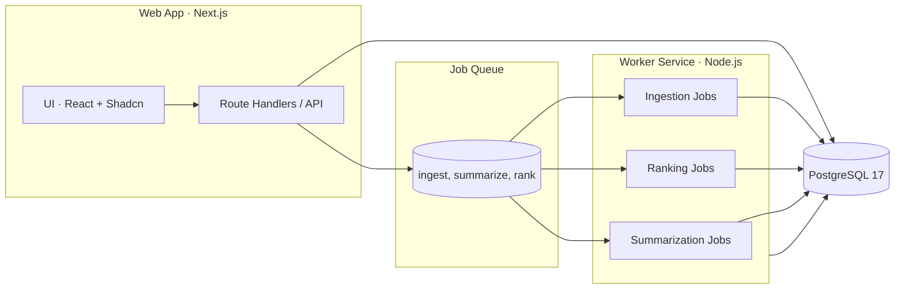
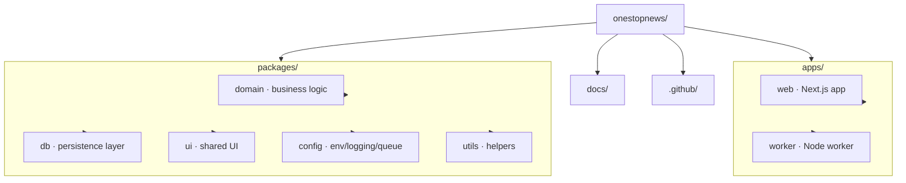

Meticulously plan to create an awesome README.md for the GitHub repo to host your awesome improved design (PRD). make the README.md comprehensive, informative with mermaid diagrams/charts and file hierarchy diagrams to showcase and describe the designs. include the latest versions of the tech stack in the README.md. Goal is to attract new users and contributors to the project. so please meticulously re-imagine an awesome project GitHub repo README.md

Here’s the plan and the actual README you can drop into the repo.

Modern large‑scale Next.js projects benefit from a feature‑based, layered structure and clear architecture diagrams to attract contributors, which this README is designed to showcase. [dev](https://dev.to/addwebsolutionpvtltd/architecting-large-scale-nextjs-applications-folder-structure-patterns-best-practices-2dpj)

***

## 1. Executive Summary

- Goal: Provide a **GitHub‑ready `README.md`** that sells OneStopNews to users and contributors and clearly communicates the modular‑monolith + worker + queue architecture.
- The README below includes:
  - Clear value proposition and feature overview.
  - Modern tech stack callouts (Next.js 16+, React 19+, Tailwind CSS v4, Shadcn UI, PostgreSQL 17, worker + queue).
  - Mermaid diagrams for architecture, data flow, and repo structure.
  - File hierarchy and contribution guidelines.

You can paste this directly as `README.md` at the root of the repo.

***

## 2. Implementation – README.md (drop‑in)

```markdown
# OneStopNews · Topic‑First AI News Aggregator

> Everything important, sorted by topic — with on‑demand AI summaries.

[](#-tech-stack)
[](#-tech-stack)
[](#-tech-stack)
[](#-tech-stack)
[](#-license)

---

## ✨ What is OneStopNews?

OneStopNews is a **topic‑first news aggregation platform** that groups stories by what they are about (Top, Local, Tech, Global, Finance, Politics, Gossip) instead of who published them.

It is designed for:

- **Daily readers** who want a calm, fast way to scan important stories by topic.
- **Analysts and researchers** who need a structured, high‑signal view of news, plus **on‑demand AI summaries** for compression and triage.
- **Developers** who want a reference‑grade Next.js + React + Tailwind + Shadcn architecture for a modern content app.

At its core, OneStopNews is:

- **Topic‑first**: curated categories and subcategories are the primary navigation axis.
- **Source‑respectful**: always links to the original publisher; never republishes full copyrighted content.
- **AI‑assisted, not AI‑controlled**: summaries are optional, clearly labeled, and easily compared against the original article.

---

## 🔍 Key Features

### Reader Experience

- **Topic‑first browsing**
  - Top‑level categories (Top, Local, Tech, Global, Finance, Politics, Gossip).
  - Curated subcategories (e.g., “Apple & Devices”, “Singapore transport”, “US politics”).
- **Scan‑optimized layout**
  - Lead story card + dense grid of article cards.
  - Sticky “Current view” header with story counts.
- **Search & filters**
  - Keyword search across titles/excerpts.
  - Filter by category, subcategory, time, summary availability.
  - Sort by latest, impact (importance score), or “summary ready”.
- **AI summaries on demand**
  - Per‑article summaries with bullet‑point key takeaways.
  - Clear toggle between “AI Summary” and “Original Source”.
  - Prominent external link to the publisher.

### Operational / Enterprise Features

- **Robust ingestion pipeline**
  - RSS / Atom / JSON API based ingestion.
  - Deduplication by canonical URL + content hash.
  - Source health tracking and feed freshness metrics.
- **Modular architecture**
  - Next.js web app for UI + APIs.
  - Separate worker service for ingestion, ranking, and summarization.
  - Queue‑backed jobs for reliability and backpressure.
- **AI governance**
  - Summaries cached and versioned.
  - Admin review tools for problematic outputs (roadmap).
  - Clear user‑facing disclaimers.

---

## 🧱 Tech Stack

| Layer            | Technology                                      |
|------------------|-------------------------------------------------|
| Framework        | Next.js 16+ (App Router, Route Handlers)       |
| UI               | React 19+, Shadcn UI, Tailwind CSS v4          |
| Language         | TypeScript (strict mode)                       |
| Styling          | Tailwind CSS v4 + CSS variables for theming    |
| Backend Runtime  | Node.js 24+                                    |
| Database         | PostgreSQL 17 (primary), SQLite (dev/fallback) |
| Caching (opt.)   | Redis (feed slices, hot data)                  |
| Queue            | SQS / RabbitMQ / Redis‑backed queue            |
| AI Summaries     | Pluggable LLM provider (HTTP API)              |

---

## 🏗️ High‑Level Architecture

OneStopNews adopts a **modular monolith** architecture:

- **Web App** (Next.js + React) for UI and HTTP APIs.
- **Worker Service** (Node.js) for ingestion/summarization/ranking.
- **Queue** for job orchestration.
- **PostgreSQL** as the system of record.



### Data Flow: Ingestion → Feed → Summary

```mermaid
sequenceDiagram
  participant S as Source (RSS/API)
  participant W as Worker
  participant DB as PostgreSQL
  participant Q as Queue
  participant A as API (Next.js)
  participant U as User

  rect rgb(245,245,245)
    Note over W,Q: Ingestion
    W->>Q: Schedule ingest jobs
    Q-->>W: ingest(source)
    W->>S: Fetch latest items
    S-->>W: Feed data
    W->>W: Normalize + deduplicate
    W->>DB: Upsert articles + metrics
  end

  rect rgb(245,245,245)
    Note over U,A: Browsing
    U->>A: GET /topics/:category
    A->>DB: Query feed slice
    DB-->>A: Article list
    A-->>U: Render lead + grid
  end

  rect rgb(245,245,245)
    Note over U,Q,W: Summarization
    U->>A: POST /api/summarize/:id
    A->>Q: enqueue summarize(articleId)
    Q-->>W: summarize(articleId)
    W->>DB: Read article
    W->>W: Call LLM provider
    W->>DB: Store summary
    U->>A: GET /article/:id (refresh)
    A->>DB: Article + summary
    A-->>U: Show AI summary
  end
```

---

## 📁 Project Structure

The repo is organized as a small **multi‑app workspace**:

```text
onestopnews/
├─ apps/
│  ├─ web/                # Next.js 16+ app (UI + HTTP APIs)
│  └─ worker/             # Node.js worker service (ingest, summarize, rank)
├─ packages/
│  ├─ domain/             # Pure domain logic (articles, sources, summaries, ranking)
│  ├─ db/                 # PostgreSQL access layer (ORM/SQL, migrations, seeds)
│  ├─ ui/                 # Shadcn UI wrappers + design system primitives
│  ├─ config/             # Shared config (env parsing, logging, queue clients)
│  └─ utils/              # Shared utilities (date, formatting, etc.)
├─ prisma/ or migrations/ # Database schema & migrations
├─ docs/
│  ├─ prd.md              # Project Requirements Document (PRD)
│  └─ architecture.md     # Extended architecture notes (optional)
├─ .github/
│  ├─ workflows/          # CI/CD pipelines (lint, test, typecheck, build)
├─ README.md
└─ package.json           # Workspaces, scripts, tooling
```

### Repo Structure Diagram



---

## 🚀 Getting Started

### Prerequisites

- Node.js 24+
- pnpm / npm / yarn (pnpm recommended)
- PostgreSQL 17 running locally or in the cloud
- (Optional) Redis for caching, SQS/RabbitMQ or Redis‑queue for jobs

### 1. Clone & Install

```bash
git clone https://github.com/<your-org>/onestopnews.git
cd onestopnews

# using pnpm
pnpm install
```

### 2. Environment Configuration

Create `.env` files for web and worker apps:

```bash
cp apps/web/.env.example apps/web/.env
cp apps/worker/.env.example apps/worker/.env
```

Set values such as:

- `DATABASE_URL` (PostgreSQL connection string)
- `REDIS_URL` (optional, for caching and queue)
- `QUEUE_URL` / `QUEUE_TYPE`
- `AI_PROVIDER_API_KEY`
- Any auth / SSO configs (when enabled)

### 3. Database Setup

Run migrations:

```bash
# example with Prisma
pnpm db:migrate
pnpm db:seed
```

### 4. Run in Development

```bash
# terminal 1: web app
pnpm dev:web   # wraps next dev in apps/web

# terminal 2: worker service
pnpm dev:worker   # runs the job worker in apps/worker
```

Visit:

- Web app: `http://localhost:3000`

---

## 🧬 Architecture Details

### Web App (apps/web)

- **Next.js 16+ App Router**
  - Server Components for feed pages and layout.
  - Route Handlers for HTTP APIs under `/api/*`.
- **Feature‑based structure** (example):

```text
apps/web/src/
├─ app/
│  ├─ (marketing)/
│  ├─ (app)/
│  │  ├─ topics/
│  │  │  ├─ [category]/
│  │  │  │  └─ [subcategory]/page.tsx
│  │  ├─ article/
│  │  │  └─ [id]/page.tsx
│  │  └─ layout.tsx
│  └─ api/
│     ├─ articles/route.ts
│     ├─ categories/route.ts
│     ├─ source-health/route.ts
│     ├─ ingest/route.ts
│     └─ summarize/[id]/route.ts
├─ features/
│  ├─ topics/
│  ├─ feed/
│  ├─ article-detail/
│  ├─ search/
│  └─ admin/
└─ shared/
   ├─ components/
   ├─ hooks/
   └─ lib/
```

- **UI Layer**: Shadcn UI primitives wrapped in a `packages/ui` design system.
- **Data Layer**: Typed fetchers calling Route Handlers; React Query or RSC `fetch` as appropriate.

### Worker Service (apps/worker)

- Long‑running Node.js process listening to queue events:
  - `ingest-source`
  - `rank-feeds`
  - `summarize-article`
- Uses `packages/domain` + `packages/db` to:
  - Fetch and normalize sources.
  - Deduplicate and persist articles.
  - Compute importance scores and feed slices.
  - Call AI provider for summaries.

---

## 🧪 Quality, Testing & Tooling

- **TypeScript strict mode** across all apps and packages.
- **ESLint + Prettier** for consistent style.
- **Jest / Vitest** (or similar) for:
  - Domain logic unit tests (ranking, dedupe, classification).
  - API route handler tests.
- **Playwright / Cypress** for end‑to‑end flows (browsing topics, summarizing, admin actions).
- **GitHub Actions** CI:
  - `lint` → `typecheck` → `test` → `build`.

Example scripts (root `package.json`):

```jsonc
{
  "scripts": {
    "dev:web": "pnpm --filter web dev",
    "dev:worker": "pnpm --filter worker dev",
    "build": "pnpm build:web && pnpm build:worker",
    "lint": "eslint .",
    "typecheck": "tsc -b",
    "test": "vitest run"
  }
}
```

---

## 🤝 Contributing

Contributions are welcome — from UI polish to ingestion adapters.

### How to Contribute

1. **Fork** the repo.
2. Create a feature branch: `feat/topic-nav-keyboard-access`.
3. Keep changes **surgical**:
   - Touch only what you need.
   - Match existing style & patterns.
4. Add or update tests.
5. Run:
   - `pnpm lint`
   - `pnpm typecheck`
   - `pnpm test`
6. Open a PR with:
   - Clear description.
   - Screenshots / CLI output where helpful.
   - Notes on trade‑offs or open questions.

### Good First Issues

- Add new subcategories and topic copy.
- Improve accessibility (keyboard nav, ARIA).
- Add new ingestion adapters for public RSS/API sources.
- Improve AI summary prompts / formatting.

---

## 🗺️ Roadmap

- **v1.0 – Productionized MVP**
  - Modular monolith + worker + queue.
  - Topic‑first browsing, search, on‑demand summaries.
- **v1.1 – Personalization & Admin**
  - Persistent user preferences and read‑later list.
  - Admin dashboards for ingestion/summarization.
- **v1.2 – Advanced Ranking & Feeds**
  - Improved impact scoring.
  - Pre‑computed feed slices and smarter caching.
- **v2.0 – Enterprise Extensions**
  - SSO / SAML / OIDC.
  - Advanced topic modeling, alerts, and multi‑tenant support.

---

## 📜 License

This project is currently **private / all rights reserved**.  
Contact the maintainer if you want to discuss licensing or collaboration.

---
```

***

## 3. Next Steps

- If you want, the next iteration can:
  - Tailor badges (CI status, coverage, package manager) to your actual CI/CD.
  - Add concrete links (demo URL, docs, PRD in `docs/prd.md`).
  - Tighten any sections to match your preferred tone (more brutalist / more editorial).

# https://www.perplexity.ai/search/you-are-claw-code-my-elite-cod-HVESLPS6Qb6QdQ85nrgbgg
